## Task 02: Configure network connectivity

## Introduction

Ensuring robust network connectivity is essential for Adatum Corporation to maintain high availability and disaster recovery for their eBook store, Adatum Books. To prevent disruptions to their eBook shopping services, they seek to implement a solution that ensures seamless network connectivity between their on-premises SQL VM and Azure SQL Managed Instance.

## Description

In this task, you'll configure network security settings, open required firewall ports, and test connectivity between SQL Server and the Azure SQL Managed Instance.

The Azure SQL Server VM is within the same virtual network as the targeted Managed Instance in this scenario.

## Success criteria

-   You configured the network security settings and opened the required firewall ports.
-   You tested and confirmed connectivity between SQL Server and the Azure SQL Managed Instance.
-   You ensured the Azure SQL Server VM is within the same virtual network as the targeted Managed Instance.

## Learning resources

-   Configure network security settings
-   [Test connectivity between SQL Server and the Azure SQL Managed Instance](https://learn.microsoft.com/en-us/troubleshoot/sql/database-engine/connect/test-oledb-connectivity-use-udl-file)

***

**SQL Server on Azure Virtual Machines**

For the link to work, you must have network connectivity between SQL Server and Managed Instance. The network option that you choose depends on whether or not your SQL Server instance is on an Azure network.

Deploying SQL Server on Azure Virtual Machines in the same Azure virtual network that hosts SQL Managed Instance is the simplest method, because network connectivity will automatically exist between the two instances.

{: .important } 
> For more information, see [Quickstart: Configure an Azure VM to connect to Azure SQL Managed Instance](https://learn.microsoft.com/en-us/azure/azure-sql/managed-instance/connect-vm-instance-configure?view=azuresql).

***

**Different virtual network**

If your SQL Server on Azure Virtual Machines instance is in a different virtual network from your managed instance, you need to make a connection between both virtual networks. The virtual networks don't have to be in the same subscription for this scenario to work.

There are two options for connecting virtual networks:

-   [Azure virtual network peering](https://learn.microsoft.com/en-us/azure/virtual-network/virtual-network-peering-overview)
-   VNet-to-VNet VPN gateway ([Azure portal](https://learn.microsoft.com/en-us/azure/vpn-gateway/vpn-gateway-howto-vnet-vnet-resource-manager-portal), [PowerShell](https://learn.microsoft.com/en-us/azure/vpn-gateway/vpn-gateway-vnet-vnet-rm-ps), [Azure CLI](https://learn.microsoft.com/en-us/azure/vpn-gateway/vpn-gateway-howto-vnet-vnet-cli))

Peering is preferable because it uses the Microsoft backbone network, so from the connectivity perspective, there's no noticeable difference in latency between virtual machines in a peered virtual network and in the same virtual network.

Virtual network peering is supported between networks in the same region. Global virtual network peering is supported for instances hosted in subnets created after September 22, 2020.

{: .important }
> For more information, see [Frequently asked questions (FAQ)](https://learn.microsoft.com/en-us/azure/azure-sql/managed-instance/frequently-asked-questions-faq?view=azuresql#does-sql-managed-instance-support-global-vnet-peering).

***

**SQL Server outside Azure**

If your SQL Server instance is hosted outside Azure, establish a VPN connection between SQL Server and SQL Managed Instance by using either of these options:

-   [Site-to-site VPN connection](https://learn.microsoft.com/en-us/microsoft-365/enterprise/connect-an-on-premises-network-to-a-microsoft-azure-virtual-network?view=o365-worldwide)
-   [Azure ExpressRoute connection](https://learn.microsoft.com/en-us/azure/expressroute/expressroute-introduction)

{: .highlight }
> ExpressRoute is recommended for the best network performance when you're replicating data. Provision a gateway with enough bandwidth for your use case.

## Key tasks

### 01: Network ports between the environments

<details markdown="block"> 
  <summary><strong>Expand this section to view the solution</strong></summary> 

Regardless of the connectivity mechanism, there are requirements that must be met for the network traffic to flow between the environments. 

In this task, you'll open ports in Windows Firewall on the SQL VM, then configure ports on the Network Security Group (NSG) attached to the Managed Instance.

---

#### Open ports on the Windows Firewall

1. On the Azure SQL VM, **SQLVM1**, select the Windows start menu, then enter and select **Windows Powershell**.

1. Enter the following to open the inbound and outbound ports needed, by creating new firewall rules:

    ```
    # Inbound rule: Allow TCP port 5022 (any source IP)
    New-NetFirewallRule -DisplayName "Allow TCP port 5022 inbound" -Direction Inbound -Profile Any -Action Allow -LocalPort 5022 -Protocol TCP

    # Outbound rule: Allow TCP port 5022 (any destination IP)
    New-NetFirewallRule -DisplayName "Allow TCP port 5022 outbound" -Direction Outbound -Profile Any -Action Allow -LocalPort 5022 -Protocol TCP

    # Outbound rule: Allow TCP port range 11000-11999 (any destination IP)
    New-NetFirewallRule -DisplayName "Allow TCP ports 11000-11999 outbound" -Direction Outbound -Profile Any -Action Allow -LocalPort 11000-11999 -Protocol TCP
    ```

    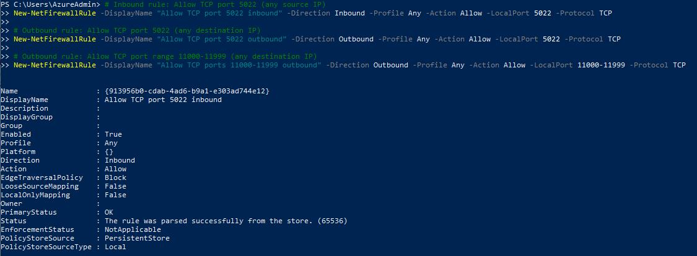

1. Select the minimize button on the VM's top control bar.

    

---

#### Open ports on the Managed Instance NSG

You'll now set up the inbound and outbound security rules for the network security group attached to the Managed Instance.

1. On the tab for **SQLVM1** in Azure, select the **ResourceGroup1** breadcrumb link in the upper left.

    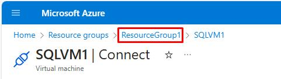

1. Select the Managed Instance network security group, **the NSG name attached to your MI (e.g., SQLMI-myName-NSG)**.

    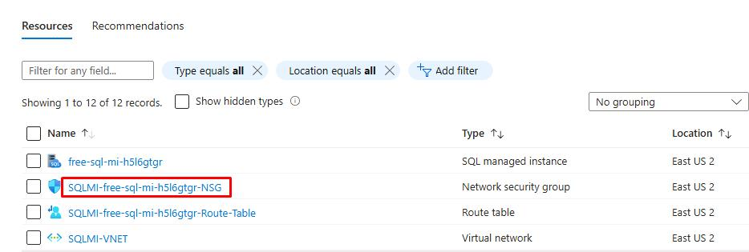

1. On the left service menu, select **Settings**, then select **Inbound security rules**.

    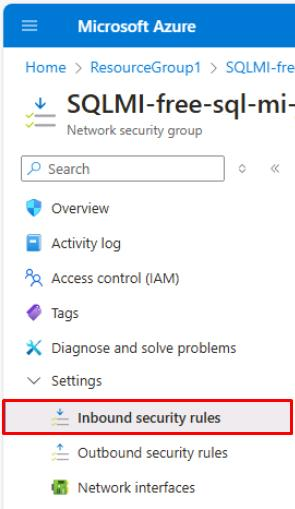

1. Select **Add** at the top.

    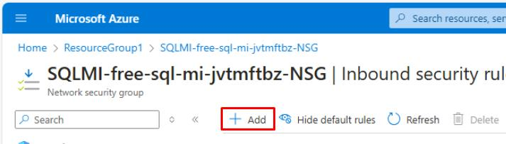

1. Use the following information on the **Add inbound security rule** pane:

    | Item | Value |
    |:--------|:--------|
    | Destination port ranges   | **5022,11000-11999**   |
    | Protocol   | **TCP**   |
    | Priority  | **200**   |
    | Name | **AllowSqlLinkInbound**  |

1. Select **Add** at the bottom of the pane.

    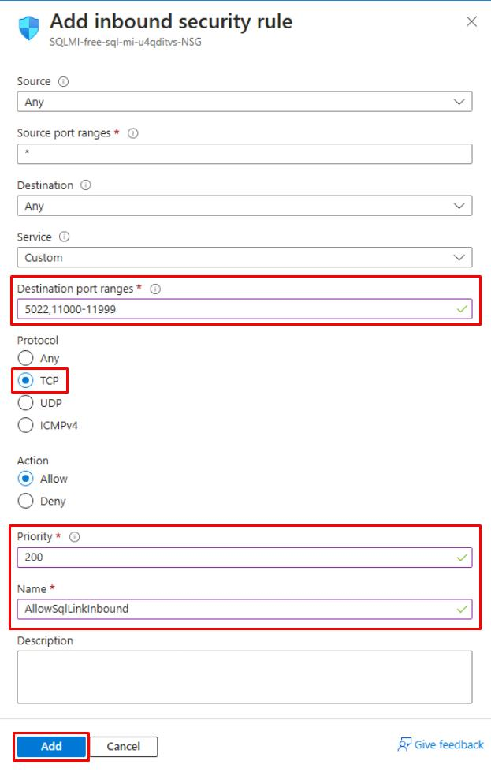

1. Select **Outbound security rules** on the left service menu.

1. Select **Add** at the top.

1. Use the following information on the **Add outbound security rule** pane:

    | Item | Value |
    |:--------|:--------|
    | Destination port ranges   | **5022,11000-11999**   |
	| Protocol   | **TCP**   |
    | Priority  | **200**   |
    | Name | **AllowSqlLinkOutbound**  |

1. Select **Add** at the bottom of the pane.

    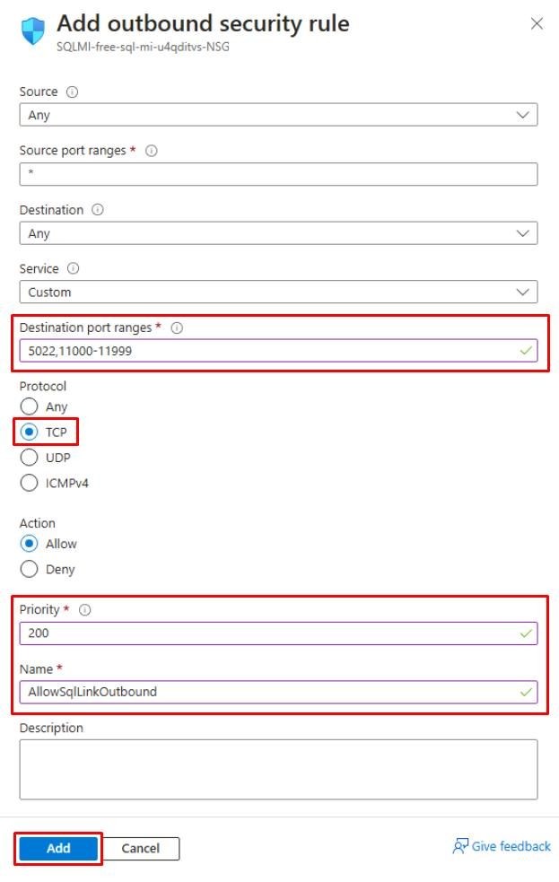


{: .important } 
> #### Knowledge 
>- Ports need to be open in every firewall in the networking environment, including the host server, as well as any corporate firewalls or gateways on the network. In corporate environments, you might need to show your network administrator the information to help open additional ports in the networking layer.
>- While you can choose to customize the endpoint on the SQL Server side, the port numbers for a SQL Managed Instance cannot be changed or customized.
>- IP address ranges of subnets hosting Managed Instances and SQL Servers must not overlap.

</details>

---

### 02: Testing network connectivity using SSMS

<details markdown="block"> 
  <summary><strong>Expand this section to view the solution</strong></summary> 

Bidirectional network connectivity between SQL Server and SQL Managed Instance is necessary for the link to work. After you open ports on the SQL Server side and configure an NSG rule on the SQL Managed Instance side, you can test connectivity by using SQL Server Management Studio (SSMS). 

{: .important }
> When you use **Network Checker** in SSMS, this automatically creates a temporary SQL Agent job on both SQL Server and the Managed Instance to check the connection. This job is then deleted after the test is finished. 
>
> You can alternatively use Transact-SQL, but you'd need to manually delete the SQL Agent job upon completion.

---

#### Retrieve the host name of the Managed Instance from Azure

1. Switch to your other tab to check on the deployment of the Managed Instance.

    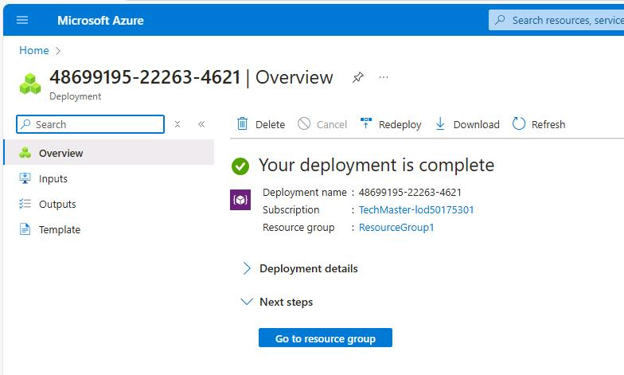

1. If completed, select **Go to resource group**.

    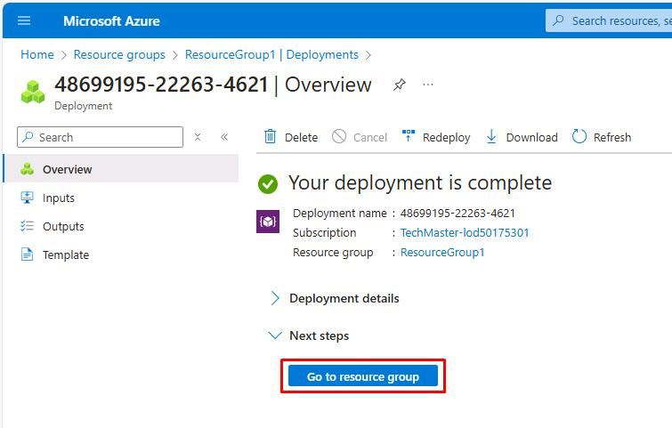

1. Select the **the name of your SQL Managed Instance** SQL managed instance.

    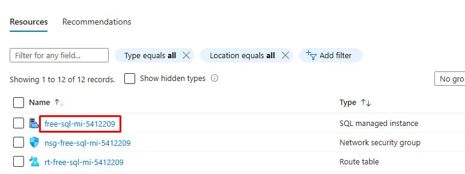

1. Under the **Essentials** section, copy the value for **Host** and paste it in a Notepad for future use throughout this lab.

    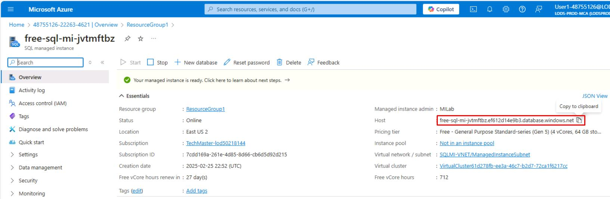

1. On the Windows task bar, reopen **SQLVM1** to return to the Azure VM.

1. If needed, sign back in using **your Azure password (used for SQL/MI authentication)**.

---

#### Test the connection

1. In SQL Server Management Studio's **Object Explorer** pane on the left, expand **Databases**.

1. Right-click the **Adatum** database, select **Azure SQL Managed Instance link**, then select **Test Connection...**

    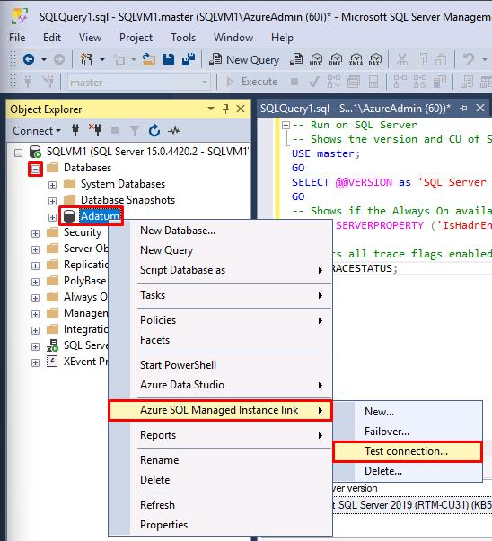

1. On the Introduction page, select **Next**.

1. All **Prerequisites** should be met. Select **Next**.

1. Select **Login**, under **Login to SQL Managed Instance**.

1. Enter the following in the **Connect to Server** window:

    | Item | Value |
    |:--------|:--------|
    | Server name   | **the NSG name attached to your MI (e.g., SQLMI-myName-NSG)**   |
    | Authentication   | **SQL Server Authentication**   |
    | Login  | **MILab**   |
    | Password  | **your Azure password (used for SQL/MI authentication)**   |

1. Select the checkboxes for **Remember password** and **Trust server certificate**, then select **Connect**.

    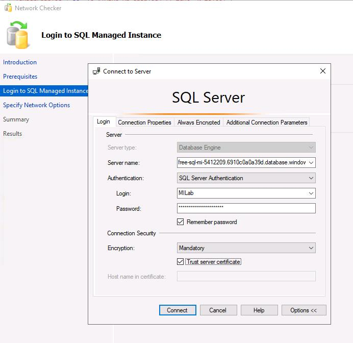

    {: .warning }
    > If you have issues connecting, the **Server name** value in the instructions is taken from the text box entry for the **Host** value retrieved from Azure. Correct the value in the text box in the earlier step, as it will continue to be referenced in the instructions.

1. Select **Next**.

    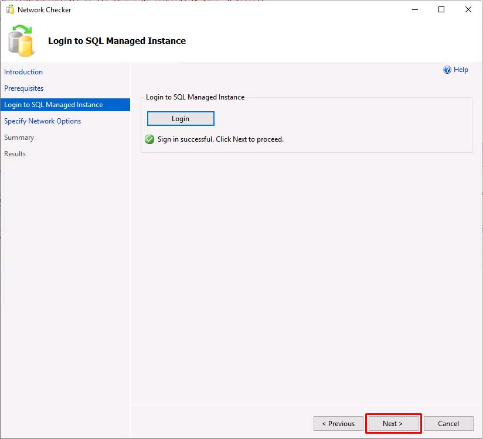

1. Enter **SQLMIEndpoint** for the **Endpoint name**, then select **Next**.

    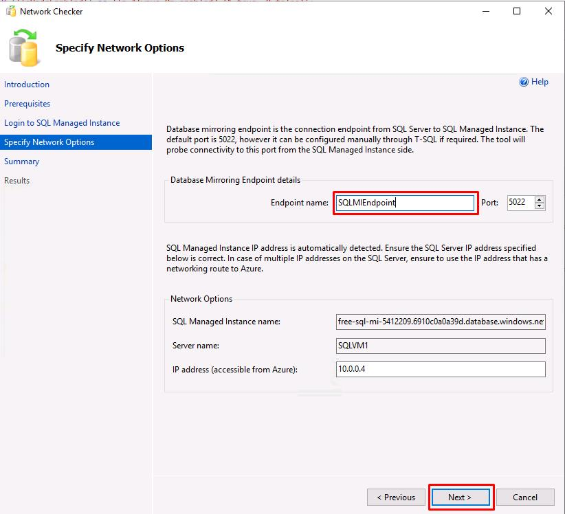

1. On the **Summary** page, select **Finish** to run the test.

1. All tests should show **Success**. Select **Close**.

    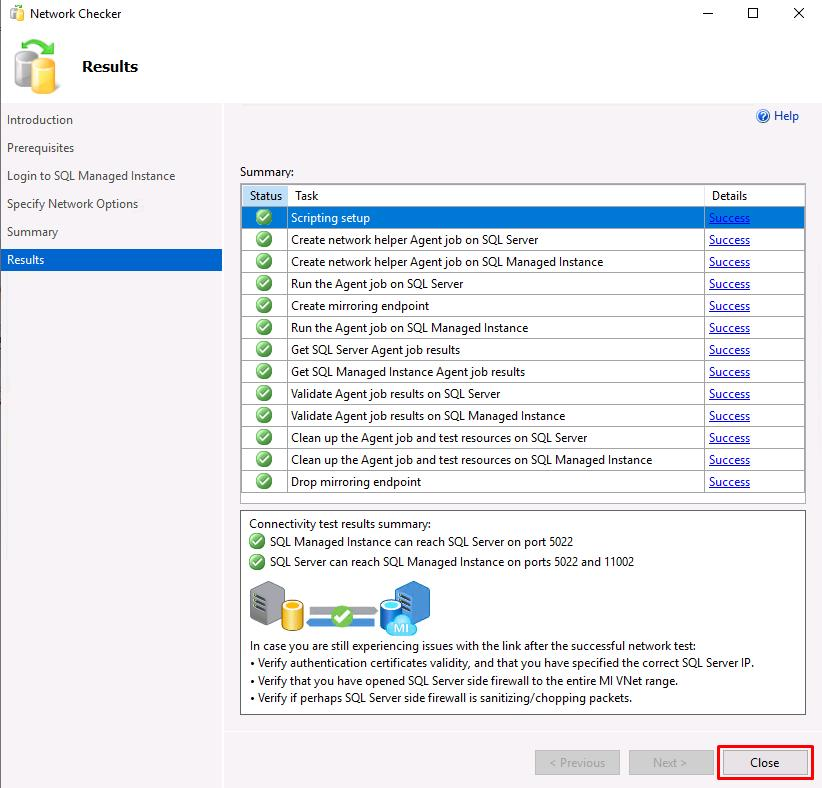

---

**Congratulations!** You've successfully completed this task.

</details>
