# Task 03: Configure link with SSMS

## Introduction

Now that your environment is set up and network connectivity is confirmed, the next step is to create a Managed Instance link. This is crucial for Adatum Corporation’s recently launched eBook store, Adatum Books, to ensure high availability and disaster recovery.

This setup will help Adatum Corporation maintain business continuity and prevent disruptions to their eBook shopping services, ensuring that Adatum Books remain operational even in the event of a failure.

## Description

In this task, you'll create a Managed Instance link. This involves preparing the database for replication, setting up the link using SQL Server Management Studio (SSMS), and verifying that the database is successfully synchronized.

## Success criteria

-   You prepared the database for replication.
-   You set up the Managed Instance link using SSMS.
-   You verified that the database was successfully synchronized.

## Learning resources

-   Tutorial: Prepare the database for replication
-   [Configure link with SSMS - Azure SQL Managed Instance](https://learn.microsoft.com/en-us/azure/azure-sql/managed-instance/managed-instance-link-configure-how-to-ssms?view=azuresql)
-   [Validate Replicated Data](https://learn.microsoft.com/en-us/sql/relational-databases/replication/validate-data-at-the-subscriber?view=sql-server-ver16)

## Key tasks

### 01: Prepare your database

 
  
<strong>Expand this section to view the solution</strong>
 

With SQL Server as your initial primary, you'll need to set its **Recovery Model** to **Full**, then run a full backup to meet requirements.

1. In SSMS's left **Object Explorer**, right-click the **Adatum** database, then select **Properties**

    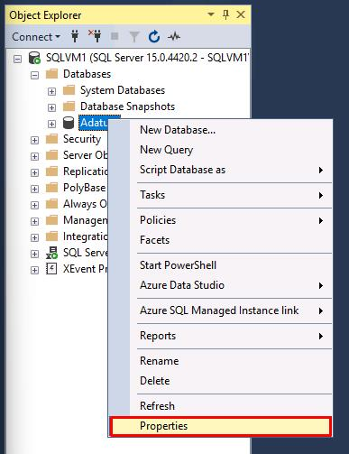

1. In the new window, select **Options** on the left.

    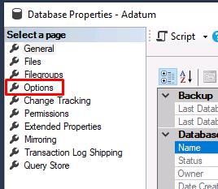

1. Select the dropdown next to **Recovery model**, select **Full**, then select **OK**.

    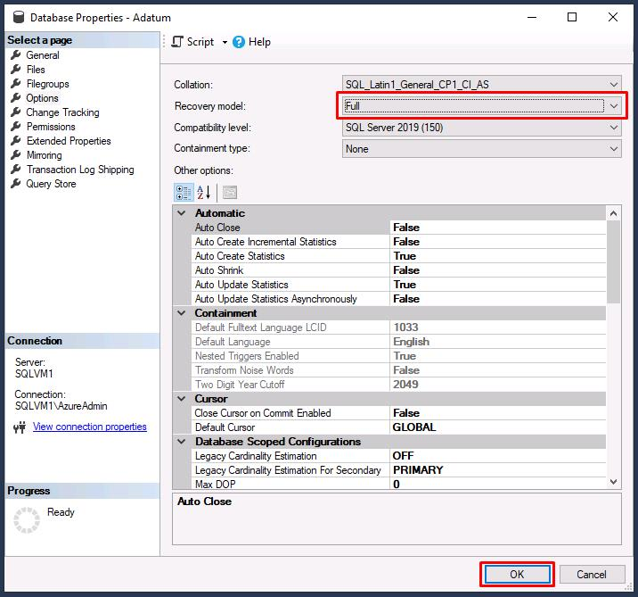

1. Right-click the **Adatum** database again, select **Tasks**, then select **Back Up...**

    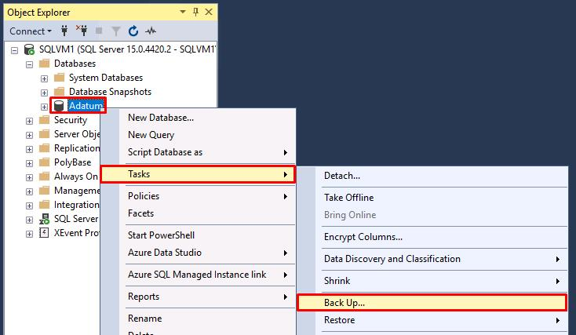

1. **Backup type** should be set to **Full**, then select **OK**.

    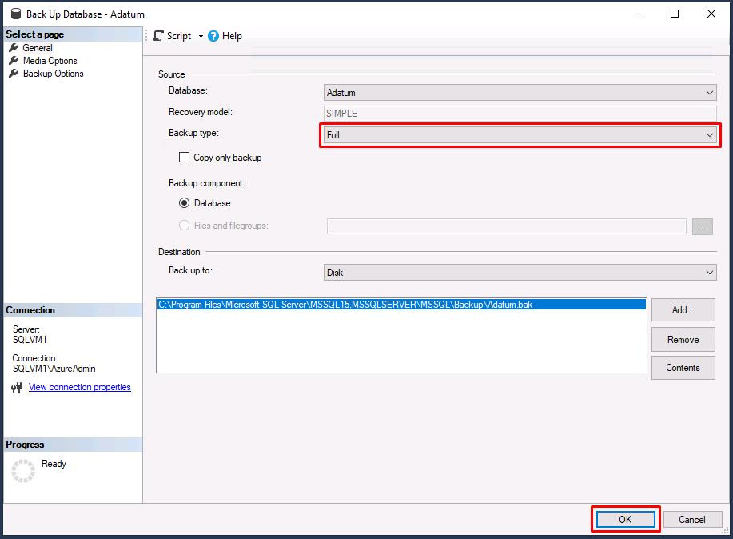

1. Select **OK** on the completion dialog.

{: .important }
> The link supports replicating user databases only. Replication of system databases is not supported. To replicate instance-level objects (stored in **master** or **msdb**), script them out and run T-SQL scripts on the destination instance.

---

### 02: Create the link to replicate the Adatum database

 
  
<strong>Expand this section to view the solution</strong>
 

In this task, you'll use the **New Managed Instance link** wizard in SSMS to create a link between your initial primary and your secondary replica.

1. Right-click the **Adatum** database again, select **Azure SQL Managed Instance link**, then select **New**.

    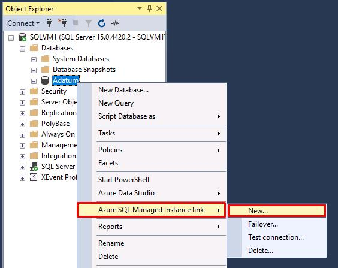

1. On the Introduction page, select **Next**.

1. Enter **`AdatumLink`** in the **Name** field, then select **Next**.

    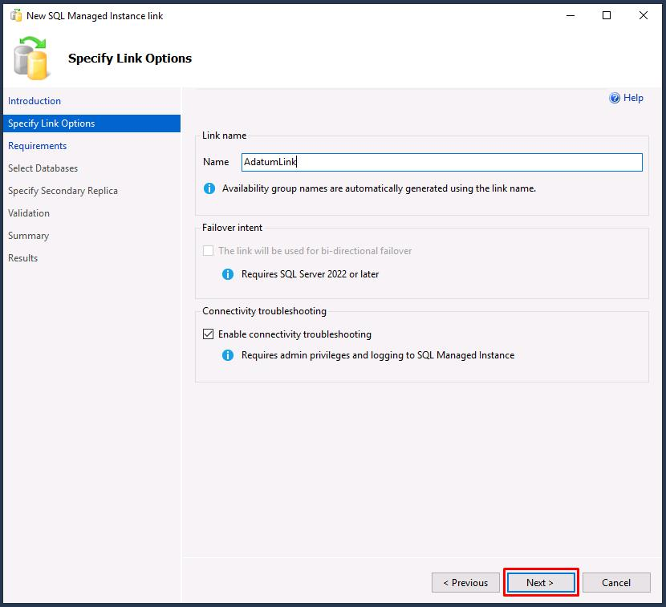

1. On **SQL Server requirements**, everything under the **Server readiness** tab will be **Ready**.

    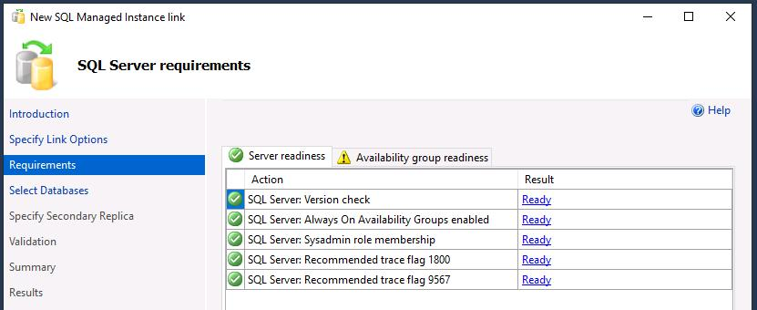

1. Select the **Availability group readiness** tab.

1. If you select the warnings under the **Result** column, you'll see that both will automatically be created, so these are safe to ignore.

    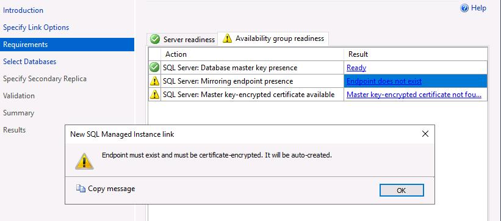

    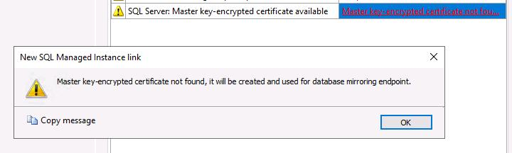

1. Select **Next** to proceed.

1. Select the checkbox next to **Adatum**, then select **Next**.

    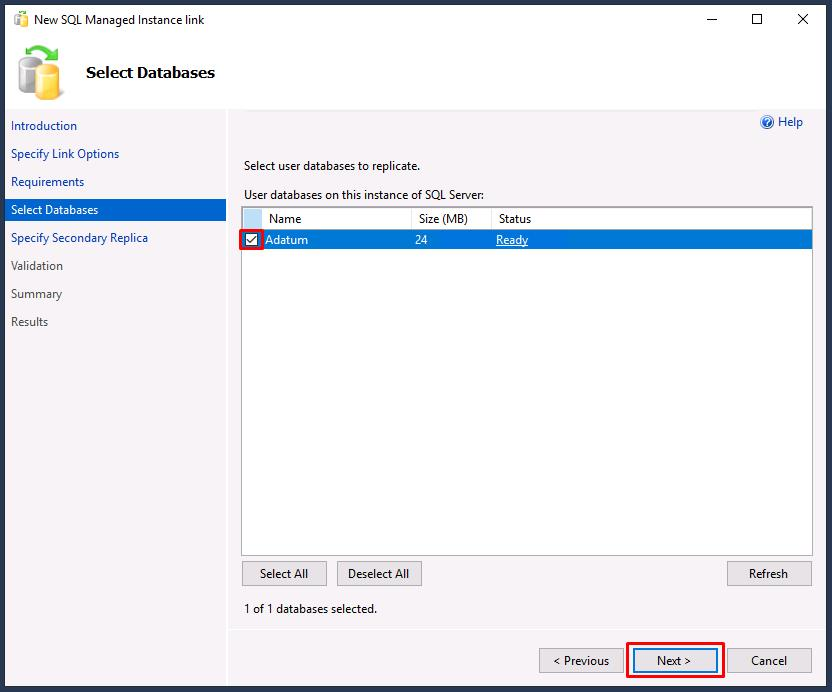

1. On **Specify Secondary Replica**, select **Add secondary replica...**

    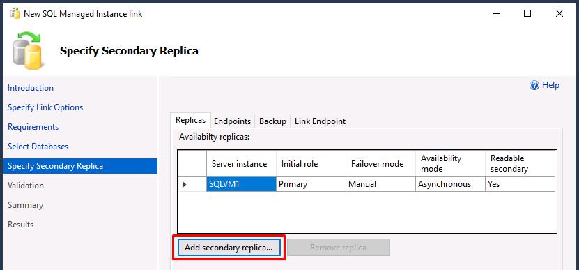

1. Select **Sign In...**, then sign in with your lab's Azure credentials:

    | Item | Value |
    |:--------|:--------|
    | Username   | Your Azure portal username   |
    | Password  | Your Azure portal password   |

    {: .warning }
    > If Internet Explorer opens, change your default browser to Edge and try again. Select this box to expand for details.
    >
    >1. Select the Windows Start menu.
    >1. Enter and select **`Default apps`**.
    >1. Under **Web browser**, select **Internet Explorer**, then select **Microsoft Edge**.
    >
    >	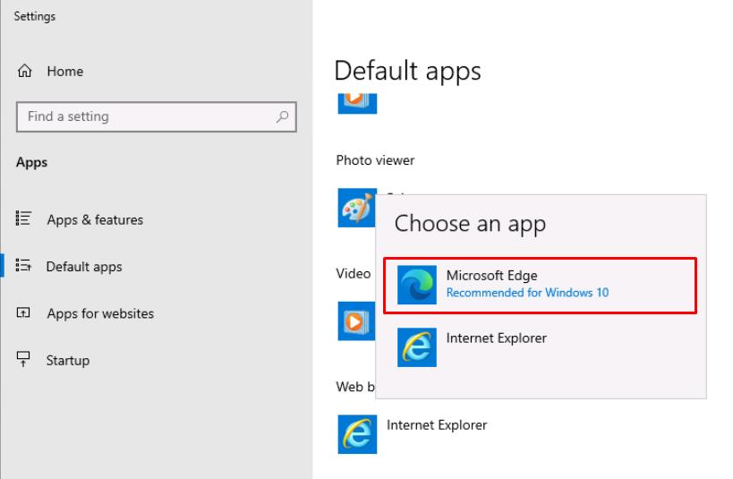

1. Once authenticated, close the browser window.

1. SSMS should automatically select:
    
    - **your Azure subscription name**
    - **your resource group name**
    - **the NSG name attached to your MI**

    {: .warning }
    > If it does not find the SQL Managed Instance, you may have to restart the Managed Instance from the Azure portal.

1. Select **Sign in...**, under **Sign in to selected SQL Managed Instance**.

1. Use the following on the **Connect to Server** window:

    | Item | Value |
    |:--------|:--------|
    | Authentication   | **SQL Server Authentication**   |
    | Login  | **MILab**   |
    | Password  | **your Azure password (used for SQL/MI authentication**   |

1. Select **Connect**.

    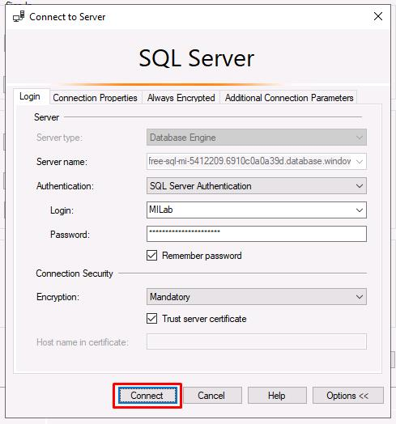

1. Select **OK** on the **Sign in** window to close it.

1. You'll leave the settings on the **Specify Secondary Replica** step as is. You can check the other tabs for **Endpoints**, **Backup**, and **Link Endpoint**, then select **Next** to proceed.

1. All validation results should show **Ready**. Select **Next**.

    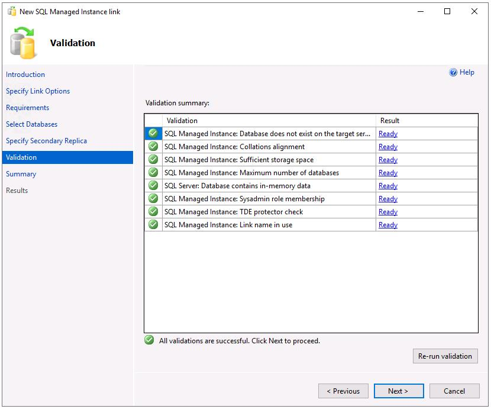

    {: .warning }
    > If you receive any errors, try selecting **Re-run validation** near the bottom right.

1. Select **Finish** to create the link.

1. All entries should show **Success**. Select **Close**.

    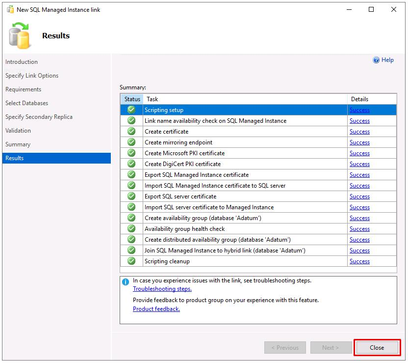

---

### 03: View the replicated database

 
  
<strong>Expand this section to view the solution</strong>
 

After the link is created, your database is replicated to the secondary replica. Depending on database size and network speed, the database might initially be in a **Restoring...** state on the secondary replica. After initial seeding finishes, the database is restored to the secondary replica and ready for read-only workloads.

1. In SSMS's **Object Explorer**, select **SQLVM1**, then select the **refresh icon** on the top controls of that pane.

    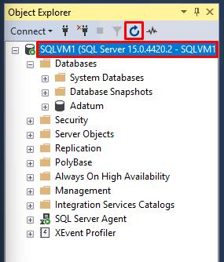

1. In **Object Explorer**, expand **Databases**. The Adatum **database** will now be appended with **(Synchronized)**.

    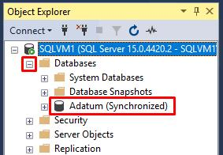

1. In **Object Explorer**, expand **Always On High Availability**, then expand **Availability Groups** to view the distributed availability group for your link.

    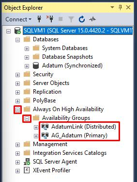

1. Right-click **AdatumLink (Distributed)**, then select **Show Dashboard**.

    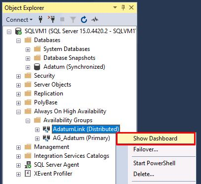

    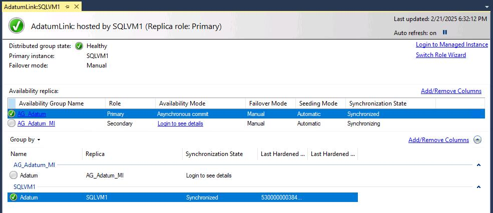

    {: .important }
    > You can view the dashboard from either replica, which shows the status of the linked database in the distributed availability group.

1. Under **Availability replica** on the dashboard, the **Synchronization state** column should show:

    - **Synchronized** for **AG_Adatum**.
    - **Synchronizing** for **AG_Adatum_MI**.

    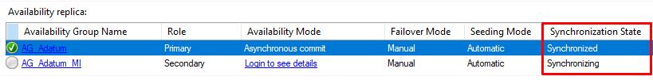

---

### 04: Transaction log backup

 
  
<strong>Expand this section to view the solution</strong>
 

If SQL Server is your initial primary, it's important to take the first [transaction log backup](https://learn.microsoft.com/en-us/sql/relational-databases/backup-restore/back-up-a-transaction-log-sql-server?view=sql-server-ver16) on SQL Server after initial seeding completes, when the database is no longer in the **Restoring...** state on Azure SQL Managed Instance. 

You should take SQL Server transaction log backups regularly to minimize excessive log growth while SQL Server is in the primary role.

1. In **Object Explorer**, under **Databases**, right-click the **Adatum (Synchronized)** database, select **Tasks**, then select **Back Up...**.

1. In the new window, next to **Backup type**, select **Transaction Log** from the dropdown.

    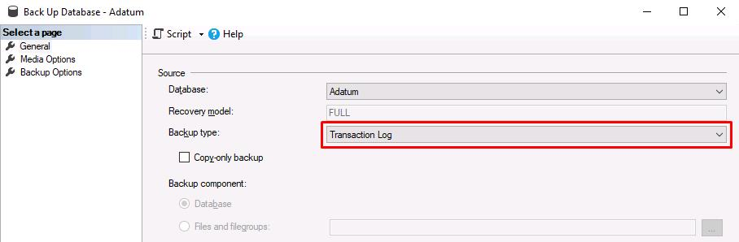

1. Under **Destination**, select **Add...**.

    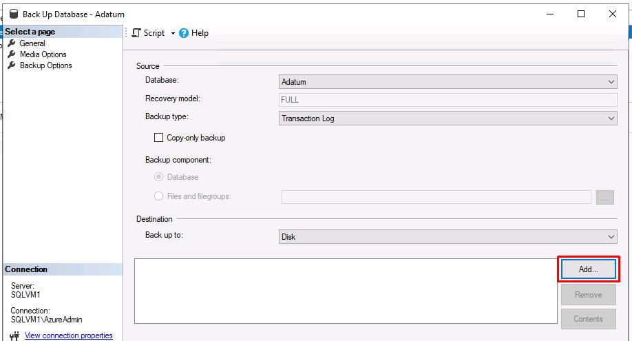

1. Select the ellipses for **File name**.

1. Enter **initial_transaction_log** for **File name**, then select **OK**.

    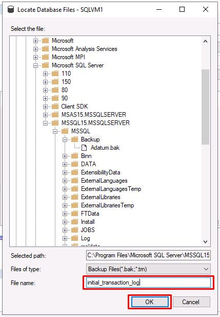

1. Select **OK** on the **Select Backup Destination** window.

1. Feel free to review the other pages for **Media Options** and **Backup Options** on the leftmost menu. You'll leave everything as default in this lab.

1. Select **OK** to run the backup.

    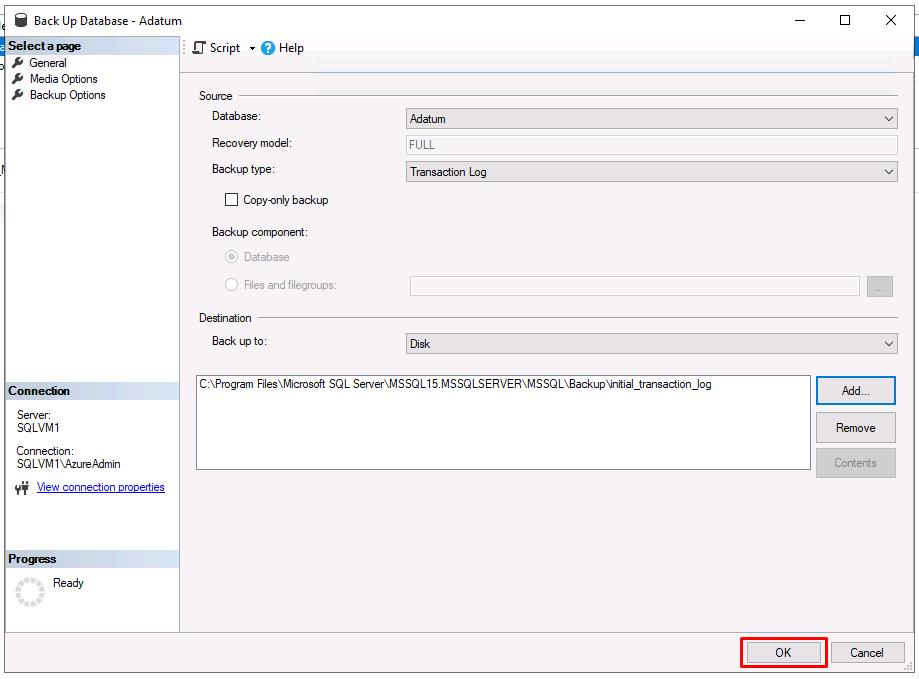

1. Select **OK** on the backup completion dialog.

---

**Congratulations!** You've successfully completed this task.

