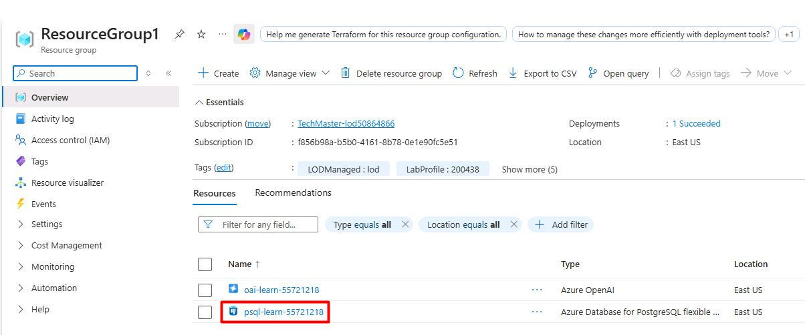
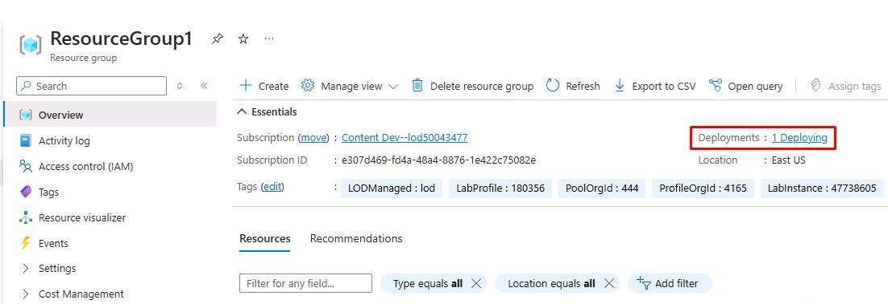
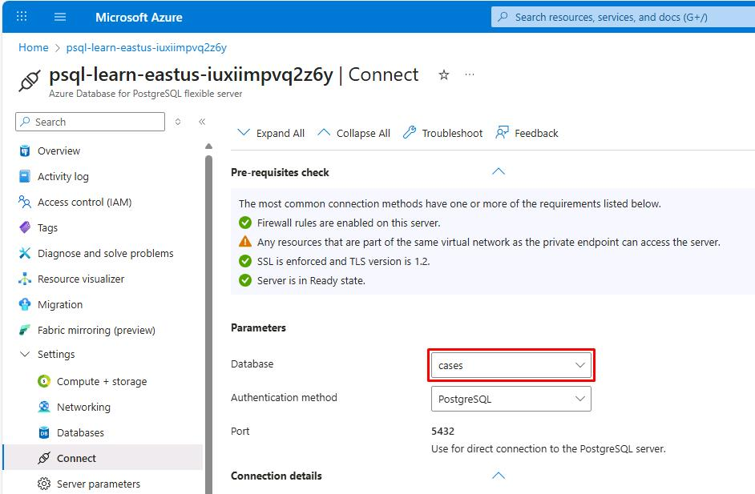
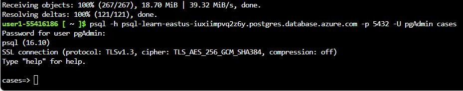
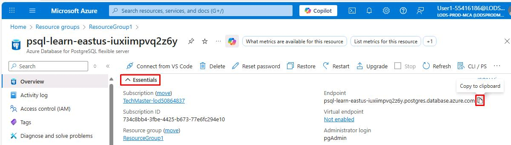
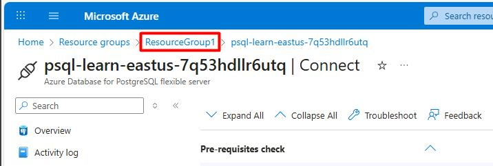
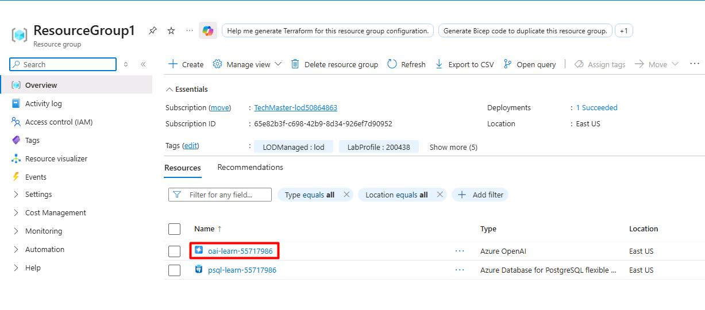

# Task 01: Getting started with AI on Azure PostgreSQL flexible server

## Introduction

Integrating AI-driven features into PostgreSQL offers several key benefits for the City of Metropolis. By leveraging advanced text processing, city employees can quickly analyze and interpret large volumes of data, leading to more informed decision-making. Semantic search capabilities enable more accurate and relevant search results, improving the efficiency of information retrieval. Additionally, these AI enhancements can automate routine tasks, freeing up staff to focus on more complex and strategic initiatives. Overall, this integration supports a more responsive and proactive approach to municipal services, and also enhances the overall quality of services provided to the community. 

## Description

In this task, you'll establish a foundation for AI-driven database operations in Azure PostgreSQL. You'll clone the necessary lab files, connect to your cases database using both the Azure Cloud Shell and pgAdmin, and install the `azure_ai` extension for direct integration with Azure AI services. This setup mirrors the City of Metropolis's approach to modernizing public services through robust data handling and advanced analytics.

## Success criteria

- You accessed and cloned the repository containing the necessary scripts and configuration files.
- You established a connection to the cases database using both Azure Cloud Shell and pgAdmin.
- You installed the **azure_ai** extension to enable AI functionalities within the PostgreSQL environment.
- You used AI-driven text processing features to analyze and interpret data.
- You configured and executed semantic search queries to retrieve relevant and accurate information efficiently.

## Learning resources

- [Integrate Azure AI capabilities into Azure Database for PostgreSQL - Flexible Server](https://learn.microsoft.com/en-us/azure/postgresql/flexible-server/how-to-integrate-azure-ai)
- [Build AI Apps with Azure Database for PostgreSQL](https://learn.microsoft.com/en-us/training/paths/build-ai-apps-azure-database-postgresql/)

===

## 01: Clone TechConnect lab repo

The City of Metropolis relies on standardized scripts and templates to manage its data environment. By cloning the TechConnect lab repository, you ensure that everyone follows the same procedures when deploying AI features.
In this task, you will clone the TechConnect lab repository, which contains the scripts and configuration files needed to configure AI features within an Azure Database for PostgreSQL Flexible Server environment.

1. Open a browser, go to `portal.azure.com`, then sign in with your credentials:


1. Select the **Cloud Shell** icon in Azure's global controls to open a new [Cloud Shell](https://learn.microsoft.com/azure/cloud-shell/overview) pane.

    

1. Select **Bash**.

    

1. Select **No storage account required**, select your **Subscription**, then select **Apply**.

    

1. At the Cloud Shell prompt, enter the following to clone the GitHub repo containing exercise resources:

    ```
    git clone https://github.com/LODSContent/pg-sk-agents-lab.git
    ```


## 02: Connect to your database using psql in the Azure Cloud Shell

Municipal IT teams often work in varied environments. Using the Azure Cloud Shell ensures secure, consistent access to PostgreSQL resources without requiring local installations or complex VPN setups.
In this task, you'll connect to the **cases** database on your Azure Database for PostgreSQL flexible server using the [psql command-line utility](https://www.postgresql.org/docs/current/app-psql.html) from the [Azure Cloud Shell](https://learn.microsoft.com/azure/cloud-shell/overview).

1. In the Azure portal, under the **Navigate** section, select **Resource Groups**.

    

1. Select **ResourceGroup1**.
    
1. Select the **psql-learn-@lab.LabInstance.Id** Azure Database for PostgreSQL flexible server.

    

    {: .warning }
    > It may take 5-10 minutes to start and finish deploying.
    >
    > 

1. In the leftmost service menu, select **Settings** > **Connect**.

1. Under the **Parameters** section, set **Database** to **cases**.

    

1. Move through the page, expand **Connect from browser or locally.**

1. Copy the command, then paste it in Cloud Shell using right-click > **Paste**.

    {: .warning }
    > The **Ctrl+V** pasting shortcut will not work.

1. At the **Password for user pgAdmin** prompt, enter `passw0rd`.

    {: .warning }
    > Wait a couple seconds for password entry to be typed. The text cursor does not move.

    

    {: .note }
    > Once signed in, the **psql** prompt for the **cases** database is displayed.

1. You'll continue working in the Cloud Shell throughout the remainder of this task. It may be helpful to select the **Maximize** button in the upper-right corner of the pane.

    

===

## 03: Populate the database with sample data and explore

Before configuring AI services, the City of Metropolis needs relevant test data. By creating tables and inserting sample records, officials can validate the AI features on realistic data (e.g., legal cases or citizen service requests).
In this task, you will add a couple of tables to the **cases** database and populate them with sample data so you have information to work with as you review the extension's functionality.

1. Run the following command to create the **cases** tables for storing law cases data:

    ```
    \i pg-sk-agents-lab/Scripts/initialize_dataset.sql;
    ```

1. Enter the following command to allow the extended display to be automatically applied:

    ```
    \x auto
    ```

    {: .important }
    > Enabling the extended display for query results in psql improves the readability of output for subsequent commands. 

1. Retrieve a sample of data from the **cases** table. This allows us to examine the structure and content of the data stored in the database.

    ```
    SELECT * FROM cases LIMIT 1;
    ```

    

===

## 04: Setting up PGAdmin

Beyond command-line interfaces, the City of Metropolis benefits from a graphical tool for easier database management. pgAdmin streamlines administrative tasks, letting staff quickly configure AI capabilities.
In this task, after verifying connections via the Azure Cloud Shell, you'll switch to [pgAdmin](https://www.pgadmin.org/)-a robust, open-source platform for PostgreSQL administration and development. This step accelerates the city's ability to configure and manage AI features.

Using pgAdmin makes it easier to explore the output and understand how the AI features work in PostgreSQL. 

1. Open a new browser tab, then go to `portal.azure.com`.

1. In Azure's top global search bar, enter and select `Resource groups`.

1. Select **ResourceGroup1**.

1. Select **psql-learn-@lab.LabInstance.Id**.

1. Under the **Essentials** section, copy and paste the value of **Endpoint** into the following text box.

    **Endpoint**: @lab.TextBox(PGHOST)

    

    {: .warning }
    > This value will be used for future reference in the instructions.

1. In the leftmost service menu, go to **Settings** > **Connect**. 

1. Observe the page instructions in Azure on how to connect to **pgAdmin 4**.

    

1. On your VM's desktop, open **pgAdmin 4 v8**.

1. In the leftmost browser tree pane, right-click **Servers**, then select **Register** > **Server**.

    

1. In the **Name** field, enter:

    ```
    Azure Database for PostgreSQL
    ```

1. At the top, select the **Connection** tab.

1. Enter the following details:

    | Item | Value |
    |:--------|:--------|
    | Host name/address  | `@lab.Variable(PGHOST)`   |
    | Port  | **5432**   |
    | Maintenance database  | `cases`   |
    | Username  | `pgAdmin`   |
    | Password  | `passw0rd`   |

    

1. In the lower-right corner of the dialog, select **Save**. 

    {: .note }
    > **pgAdmin 4** will establish the connection.
    >
    > Once connected, you can expand the server in the left browser tree to view databases, schemas, and tables. You can also interact with the server using the built-in query tool and manage your database objects.

1. In the leftmost browser tree, expand **Azure Database for PostgreSQL** > **Databases**, then select **cases**.

    

1. With **cases** selected, select the **Query Tool** button at the top of that pane to start working with queries in the upcoming sections.

    

===

## 05: Install and configure the azure_ai extension

For advanced data processing, Metropolis must integrate Azure AI services directly within PostgreSQL. The azure_ai extension allows seamless interaction with Azure OpenAI and Azure AI Language services.
In this task, you will install the **azure_ai** extension into your database and set up connections to your Azure AI Services resources. Doing so enables direct communication for automated text analysis, summarizations, and more.

{: .note }
> You'll use **pgAdmin** for the following steps.

{: .important }
> Before an extension can be installed and used in an Azure Database for PostgreSQL flexible server database, it must be added to the server's **allowlist**, as described in [how to use PostgreSQL extensions](https://learn.microsoft.com/azure/postgresql/flexible-server/concepts-extensions#how-to-use-postgresql-extensions).

To enable the extension in your database, follow these steps:

1. Enter the following command in the pgAdmin **Query** pane. 

    ```
    SHOW azure.extensions;
    ```

    {: .note }
    > This verifies the **azure_ai**, **vector**, **age** and **pg_diskann** extensions were successfully added to your server's **allowlist** by the Bicep deployment script that ran when setting up your environment.

1. On the top bar of the editor, select the **Execute script** button.

    

    {: .note }
    > Your output will look similar to the following:
    >
    > 

1. Install the **azure_ai** extension using the [CREATE EXTENSION](https://www.postgresql.org/docs/current/sql-createextension.html) command. Overwrite the previous query with the following:

    `CREATE EXTENSION IF NOT EXISTS azure_ai;`

1. Select the **Execute script** button.

    

    {: .important }
    > **CREATE EXTENSION** loads a new extension into the database by running its script file. This script typically creates new SQL objects such as functions, data types, and schemas. An error is thrown if an extension of the same name already exists. Adding **IF NOT EXISTS** allows the command to execute without throwing an error if it's already installed.

===

## 06: Explore the Azure AI schema
 Metropolis's IT department needs to understand how AI services function within PostgreSQL to effectively manage user queries and automate tasks.

The **azure_ai** schema provides the framework for directly interacting with Azure AI and ML services from your database. It contains functions for setting up connections to those services and retrieving them from the **settings** table, also hosted in the same schema. The **settings** table provides secure storage in the database for endpoints and keys associated with your Azure AI and ML services.

{: .important }
> Review the schema: [Configure the azure_ai extension](https://learn.microsoft.com/en-us/azure/postgresql/flexible-server/generative-ai-azure-overview#configure-the-azure_ai-extension)

- Review the functions defined in the **azure_ai** schema. 

    | Schema |  Name  | Result data type | Argument data types | Type |
    |:---------|:---------|:---------|:---------|:---------|
    | azure_ai | get_setting | text      | key text      | func |
    | azure_ai | set_setting | void      | key text, value text |func |
    | azure_ai | version  | text      |           | func |


    {: .important }> Because the connection information for Azure AI services, including API keys, is stored in a configuration table in the database, the **azure_ai** extension defines a role called **azure_ai_settings_manager** to ensure this information is protected and accessible only to users who have been assigned that role. This role enables reading and writing of settings related to the extension. 

---

### Exploring the Azure AI functions

Only members of the **azure_ai_settings_manager** role can invoke the **azure_ai.get_setting()** and **azure_ai.set_setting()** functions. In an Azure Database for PostgreSQL flexible server, all admin users (those with the **azure_pg_admin**</code> role assigned) are also assigned the **azure_ai_settings_manager**</code> role.

Once these settings are properly configured, Metropolis can quickly integrate cognitive services-for example, to process lengthy legal documents or citizen requests-directly in its database.

To demonstrate how you use the **azure_ai.set_setting()**</code> and **azure_ai.get_setting()**</code> functions, configure the connection with your Azure OpenAI resource.

1. Go back to your Edge window.

1. Near the upper-left corner of the page, select the **ResourceGroup1** breadcrumb link.

    

1. Select the **oai-learn-@lab.LabInstance.Id** Azure OpenAI resource.

    

1. In the leftmost service menu, go to **Resource Management** > **Keys and Endpoint**.

1. Paste the value for **KEY 1** in a notepad for the next step.

1. Paste the value for **Endpoint** in a notepad for the next step.

    

    {: .important }
    > You can use either **KEY 1** or **KEY 2**. Always having two keys allows you to securely rotate and regenerate keys without causing service disruption.

1. Once you have your endpoint and key, open the pgAdmin 4 window.

1. Enter the following in the **Query** pane to add your values to the configuration table:

    ```sql
    SELECT azure_ai.set_setting('azure_openai.endpoint', '@lab.Variable(ENDPOINT)');
    SELECT azure_ai.set_setting('azure_openai.subscription_key', '@lab.Variable(API_KEY)');
    ```

    {: .note }
    > Replace `@lab.Variable(ENDPOINT)` and `@lab.Variable(API_KEY)` in the formula above with the values you saved in your notepad previously.
`
    {: .warning }
    > This code block uses your input from the above text boxes for **KEY 1** and **Endpoint**. 

    {: .highlight }
    > Using the **Ctrl+V** pasting shortcut will work in pgAdmin.

1. Select the **Execute script** button on the toolbar.

    

1. Verify the settings were written into the **azure_ai.settings** table. Enter the following, then select **Execute script**:

    ```
    SELECT azure_ai.get_setting('azure_openai.endpoint');  
    ```

1. Enter the following, then select **Execute script**:

    ```
    SELECT azure_ai.get_setting('azure_openai.subscription_key');
    ```

    

    The **azure_ai** extension is now connected to your Azure OpenAI account.

---

### Review the Azure OpenAI schema

The **azure_openai** schema provides the ability to integrate the creation of vector embedding of text values into your database using Azure OpenAI. Using this schema, you can [generate embeddings with Azure OpenAI](https://learn.microsoft.com/azure/ai-services/openai/how-to/embeddings) directly from the database to create vector representations of input text, which can then be used in vector similarity searches, as well as consumed by machine learning models. 

The schema contains a single function, **create_embeddings()**</code>, with two overloads. One overload accepts a single input string, and the other expects an array of input strings.

Review the details of the functions in the **azure_openai**</code> schema: [Configure OpenAI endpoint and key](https://learn.microsoft.com/en-us/azure/postgresql/flexible-server/generative-ai-azure-openai#configure-openai-endpoint-and-key)

The documentation shows the two overloads of the **azure_openai.create_embeddings()**</code> function, allowing you to review the differences between the two versions of the function and the types they return. 

1. Enter the following query and then select **Execute script**:

    ```
    SELECT azure_openai.create_embeddings('text-embedding-3-small', 'Sample text for PostgreSQL Lab') AS vector;
    ```

    

    {: .note }
    > This is a simplified example of using the function, creating a vector embedding for a sample query. The **deployment_name**</code> parameter is set to **embedding**</code>, which is the name of the deployment of the **text-embedding-3-small**</code> model in your Azure OpenAI service. 


{: .important }
> [Embeddings](https://learn.microsoft.com/azure/postgresql/flexible-server/generative-ai-overview#embeddings) are a concept in machine learning and natural language processing (NLP) that involves representing objects such as words, documents, or entities, as [vectors](https://learn.microsoft.com/azure/postgresql/flexible-server/generative-ai-overview#vectors) in a multi-dimensional space.
>
> Embeddings allow machine learning models to evaluate how closely two pieces of information are related. This technique efficiently identifies relationships and similarities between data, allowing algorithms to identify patterns and make accurate predictions.
>
> The **azure_ai**</code> extension allows you to generate embeddings for input text. To enable the generated vectors to be stored alongside the rest of your data in the database, you must install and [enable the vector extension](https://learn.microsoft.com/azure/postgresql/flexible-server/how-to-use-pgvector#enable-extension). However, that's outside the scope of this exercise.

---

**Congratulations!** You've successfully completed this task.