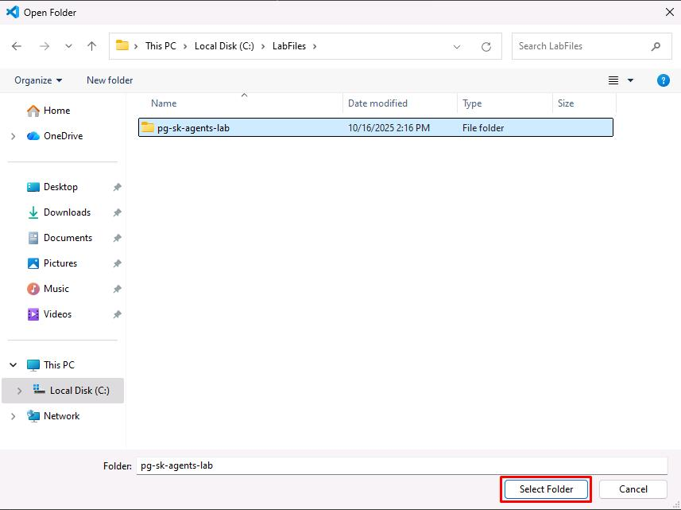

# Task 03: Build the Agentic App

## Introduction
Metropolis now moves beyond smart queries to a smart assistant. In this task, you'll assemble an agentic app that reasons over the city's legal-case database, uses semantic and graph signals to rank results, and even pulls in real-world weather evidence when relevant. The result is a guided, explainable workflow that helps staff answer complex questions faster and with better grounding.

## Description
You'll work in a Jupyter notebook to wire up a Semantic Kernel agent that can call purpose-built plugins, test its functionality, get weather data, and setup semantic memory.

## Success criteria
- You ran the notebook and configured environment variables for Azure OpenAI and PostgreSQL.  
- You created and registered the **DatabaseSearchPlugin**, **SemanticRerankingPlugin**, **GraphDatabasePlugin**, and **WeatherPlugin**.  
- The agent answered a natural question, invoked the right functions (visible via printed logs), and returned grounded results.  
- You demonstrated semantic + graph ranking (10 relevant cases returned) and retrieved historical rainfall for a specified date/location.  
- You enabled semantic memory and verified prior prompts were recalled and used to improve a later response.

## Learning resources
- [Introduction to Semantic Kernel](https://learn.microsoft.com/en-us/semantic-kernel/overview/l)
- [Semantic operators in the Azure AI extension](https://learn.microsoft.com/en-us/azure/postgresql/flexible-server/generative-ai-azure-ai-semantic-operators#azure_airank)

===

## 01: Use the Python Jupyter Notebook

You're going to take everything you've learned so far to build an Agentic App. 

1. On the VM's taskbar, open **Visual Studio Code**.

1. On the top menu bar, select **File** > **Open Folder**.

1. Go to `C:\LabFiles`, select **pg-sk-agents-lab**, then select **Select Folder**.

    

1. In the **EXPLORER** pane, expand **Code**, then select **lab.ipynb**.

    

    {: .important }
    > For the remainder of the lab, you'll primarily work in this Python Jupyter Notebook. 
    >
    > Refer back to these instructions for **02:** and **03:**.


### 02: Environment Setup

1. In the **EXPLORER** pane, right-click any open space below the project files, then select **New File**.

1. Enter `.env` for the file name.

1. In the new **.env** file, enter the following, which contains your previously used Endpoint, Key, and credential:

    ```
    # Azure OpenAI Configuration
    AZURE_OPENAI_ENDPOINT=@lab.Variable(ENDPOINT)
    AZURE_OPENAI_KEY=@lab.Variable(API_KEY)
    AZURE_OPENAI_DEPLOYMENT=gpt-4o

    # Database Configuration
    AZURE_PG_HOST=@lab.Variable(PGHOST)
    AZURE_PG_NAME=cases
    AZURE_PG_USER=pgAdmin
    AZURE_PG_PASSWORD=passw0rd
    AZURE_PG_PORT=5432
    AZURE_PG_SSLMODE=require
    ```

    

1. On the top menu bar, select **File** > **Save**.

1. Go back to the **lab.ipynb** notebook to run the code block.


### 03: Code Review Tasks

Before running the code block in the Jupyter Notebook, you'll need to run a SQL script on the database.  

1. In VS Code's **EXPLORER** pane, expand **Scripts**, then select **create_graph.sql**.  

1. On the top menu bar, select **View** > **Command Palette**.

1. Enter `PGSQL Connect`, then select **PGSQL: Connect**.  

1. Select **Create Connection Profile**.

1. Enter the following details:

    | Item | Value |
    |:--------|:--------|
    | SERVER NAME  | `@lab.Variable(PGHOST)`   |
    | AUTHENTICATION TYPE  | **Password**   |
    | USER NAME  | `pgAdmin`   |
    | PASSWORD  | `passw0rd`   |
    | DATABASE NAME  | `cases`   |

1. Select **Save & Connect**.

    

1. In the upper-right corner of the **create_graph.sql** editor pane, select **Execute PostgreSQL Query** (the 2nd ).

    

1. In the connection profile dropdown menu, select your newly created connection.

    

    {: .note }
    > This will build the graph database via the Apache AGE extension in your Azure PostgreSQL database using the loaded 377 legal cases.  

1. On the top menu bar, select **Terminal** > **New Terminal**.

    {: .note }
    > Since you're using the Apache AGE PostgreSQL extension to provide Graph database capabilities, you'll need to enable the extension on the database.

1. Enter the following to sign in to Azure CLI:

    ```
    az login
    ```

1. Select your lab credentials, then go back to the VS Code terminal.

1. Run the following PowerShell script:

    ```
    .\Scripts\load_age.ps1
    ```

    {: .warning }
    > This script runs three main commands and may take a few minutes to complete.  

    

1. Once finished, go back to the **lab.ipynb** notebook to proceed with **Part 3.7's Review the code** step.

1. After you've completed the notebook, proceed.

---

# Conclusion

Congratulations on completing the lab!  
Select **Submit** for completion.

---

### Next Steps

We've curated additional resources to enhance your ongoing journey in building AI agents and AI-powered applications with Azure Database for PostgreSQL.

- A more detailed blog post about the legal case example of lab in the [GraphRAG Solution for Azure Database for PostgreSQL](https://aka.ms/pg-graphrag) check the code in the [GitHub repository](https://aka.ms/postgres-graphrag-solution).
- Learn more about [Graph data in Azure Database for PostgreSQL](https://aka.ms/age-blog).
- Get familiar with the new [PostgreSQL extension for Visual Studio Code](https://techcommunity.microsoft.com/blog/adforpostgresql/announcing-a-new-ide-for-postgresql-in-vs-code-from-microsoft/4414648).
- Learn more about [Semantic Ranking with the Semantic Ranker Solution Accelerator](https://aka.ms/semantic-ranker-solution-accelerator-pg-blog) and its associated [GitHub repository](https://aka.ms/pg-ranker-repo).
- Finally, our more recent solutions accelerator [Build your own advanced AI Copilot with Postgres](http://aka.ms/pg-byoac-docs) teaches you how to extract data from statements of work (SOWs) and invoices in PDF files and use AI to validate them, more details in the [GitHub repo](http://aka.ms/pg-byoac-repo).