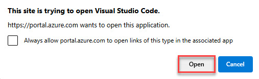

# Task 01: Initiate an Azure SQL Database connection

## Introduction

Adatum Corporation needs to establish a secure and efficient connection to their Azure SQL Database, to enable them to manage and analyze customer data more effectively and ensure that only authorized users can access the database, maintaining the security of the data.

## Description

In this task, you'll establish a connection to an Azure SQL Database by configuring network access to the Azure SQL Database and connecting to it using Visual Studio Code.

## Success criteria

-   You successfully signed in to the virtual machine and configured network access to the Azure SQL Database.
-   You established a connection to the Azure SQL Database using Visual Studio Code.
-   You verified the connection by executing an SQL query to retrieve data from the database.

## Learning resources

-   [Add a connection to an Azure SQL Database](https://learn.microsoft.com/en-us/visualstudio/azure/azure-sql-database-add-connected-service?view=vs-2022)
-   [Quickstart: Use Visual Studio Code to connect and query Azure SQL Database or Azure SQL Managed Instance](https://learn.microsoft.com/en-us/azure/azure-sql/database/connect-query-vscode?view=azuresql)


## Key tasks


### 01: Configure network access to the Azure SQL Database

1. Open a browser, go to `portal.azure.com` and sign in with your credentials:

1. Select **Resource Groups** and then select the **RG1** resource group and select the **freeDB** SQL database.

1. On the SQL database Overview page, on the right-hand side, select the **Server name: sql@lab.LabInstance.Id.database.windows.net** link.

    

1.  On the left menu, select **Settings** > **Microsoft Entra ID**.

1.  On the menu, select **Set admin** and then in the flyout, search for and select `@lab.CloudPortalCredential(User1).Username` from the list.

1.  Select **Select** to add the user as an Admin.

1.  Verify that the user was added and then on the menu, select **Save**.

    

===

### 02: Connect to the Azure SQL Database

Visual Studio Code will be used for working with the database.

1.  On the left side menu, select **Settings** > **SQL databases** and then select the **freeDB** database.

1.  On the Overview page, select the **Getting started** tab and under **Start developing**, select **Open in Visual Studio Code**.

    

1.  On the Visual Studio Code page, select **Launch it now** and select **Open**.

    >  
    >
    > 

1.  When Visual Studio Code opens, on the left-side menu, select the **SQL Extension**.

    

1.  In the SQL Extension, under **CONNECTIONS**, select **+ Add Connection**.

1.  On the **Connection Dialog** window, enter the following details:

    {: .note }
    > You can find and copy these values on the Azure SQL Database details page back in the Azure Portal. You may have to click the **X** in the upper right corner of the **Start Modern Data Workflow in Visual Studio Code** page to return to the SQL Overview page.

    | Item                                                | Value                                                                                    |
    |-----------------------------------------------------|------------------------------------------------------------------------------------------|
    | **Profile name**                                    | `freeDB`                                                                         |
    | **Server name** of your Azure SQL Database instance | `sql@lab.LabInstance.Id.database.windows.net`                                    |
    | **Authentication type**                             | **Microsoft Entra Id - Universal with MFA support**                                      |
    | **Azure account** \> **Sign in**                    | Sign in with the existing user \> Close the browser tab and return to Visual Studio Code |
    | **Database name**                                   | `freeDB`                                                                         |


    

1.  Select **Connect**.

1.  Once connected to the database, on the left of VS Code, under **CONNECTIONS**, right-click **freeDB** and select **New Query**.

    

1.  Enter the following SQL into the SQL editor as a new query and execute the statement:

    ```SQL-wrap
    SELECT [description] FROM [dbo].[walmart_product_details] WHERE id = 2
    ```

    > **Output:**
    >
    > 

    {: .important }
    > You can see from the T-SQL that you're going to create an embedding for a product name from data in the Azure SQL Database.
    >
    The query SELECT [description] FROM [dbo].[walmart_product_details] WHERE id = 2 returns "**5.0 oz., 100% pre-shrunk cotton Athletic Heather .....**" and will be sent to the OpenAI REST endpoint.
