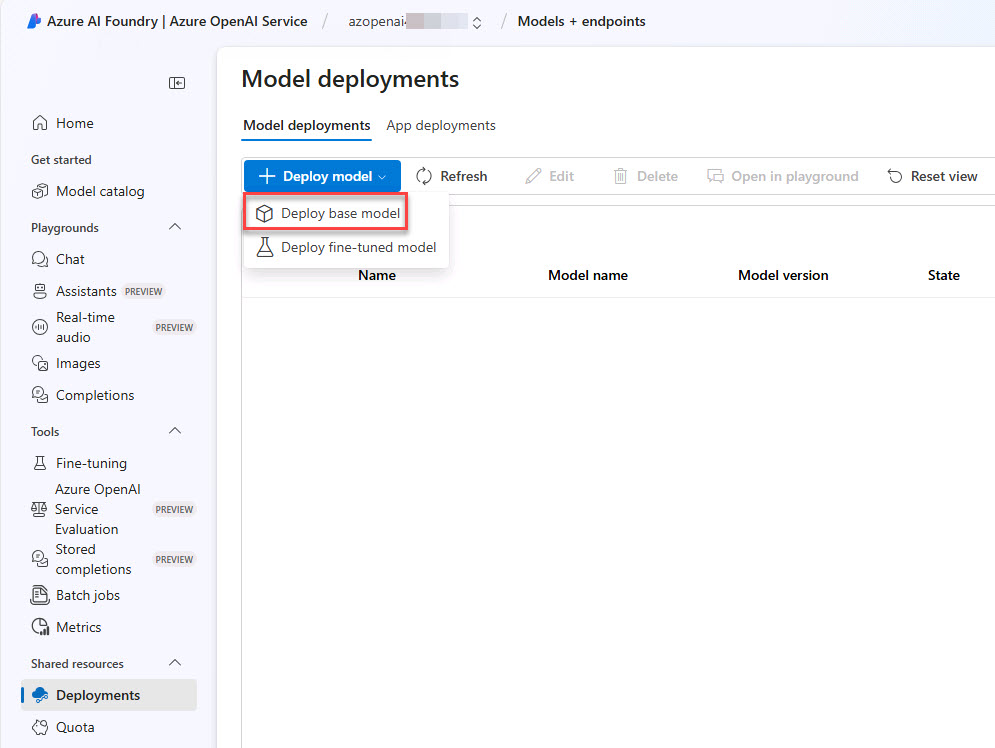
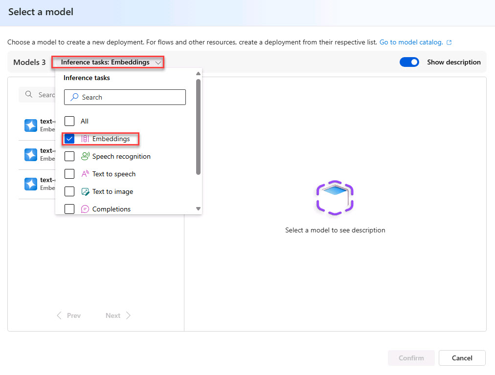
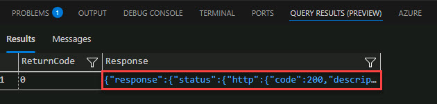
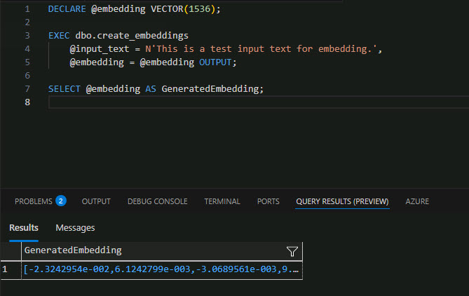

# Task 02: Create and store embeddings in the Azure SQL Database

## Introduction

Adatum wants to improve the efficiency and effectiveness of its AI-driven applications by using Azure SQL Database to create and store embeddings. An embedding is a special format of data representation that machine learning models and algorithms can easily use. It's an information-dense representation of the semantic meaning of a piece of text, encapsulated in a vector of floating-point numbers. The distance between two embeddings in the vector space correlates with the semantic similarity between the two inputs in their original format. For instance, if two texts are similar, their vector representations will also be similar.

## Description

In this task, you'll generate embeddings using OpenAI, create a master key credential for the secure handling of sensitive information, migrate JSON embeddings to native vectors for better performance and storage efficiency, and generate and store text embeddings in SQL Server using Azure OpenAI.

## Success criteria

-   You successfully generated embeddings using OpenAI and stored them in the Azure SQL database.
-   You confirmed the embeddings were stored in a native vector format in SQL Server.
-   You verified the embeddings could be used for AI-driven applications like product recommendations and semantic search.

## Learning resources

-   [Tutorial: Explore Azure OpenAI Service embeddings and document search](https://learn.microsoft.com/en-us/azure/ai-services/openai/tutorials/embeddings?tabs=python-new%2Ccommand-line&pivots=programming-language-powershell)
-   [Vector similarity search with Azure SQL & Azure OpenAI](https://learn.microsoft.com/en-us/samples/azure-samples/azure-sql-db-openai/azure-sql-db-openai/)


## Key tasks

### 01: Generate embeddings using OpenAI

1.  Return to the browser that is signed into the Azure portal and go to the **RG1** resource group.

1.  Select the **Azure OpenAI** resource.

1.  On the menu, select **Go to Azure AI Foundry portal** to open the portal in a new tab.

1.  On the left menu, select **Shared resources** \> **Deployments**.

1.  On the **Model deployments** tab select **+ Deploy model** \> **Deploy base model**.

    

1.  Select the **Inference tasks** menu, then search for and select `Embeddings`.

    

1.  From the Embedding options, select **text-embedding-ada-002** and then select **Confirm**.

1.  In the **Deploy text-embedding-ada-002** dialog, select **Deploy**.

    {: .warning }
    > If the deployment fails, redeploy with the Standard Deployment type instead of the Global Standard type.

    {: .important }
    > Standard: Pay per API call with lower rate limits. Adheres to Azure data residency promises. Best for intermittent workloads with low to medium volume. Learn more about [Standard deployments](https://aka.ms/deployment-types-standard).

1.  On the **Details** tab, under **Endpoint**, copy and paste the values into a notepad, for later use:

    | Default         | Value                   |
    |-----------------|-------------------------|
    | **Target URI:** | @lab.TextBox(uri)       |
    | **Key:**        | @lab.MaskedTextBox(key) |


### 02: Create the master key credential

In this task, you'll configure the SQL Server to store credentials for calling Azure OpenAI's text embedding API. First, you'll ensure the database has a master key, which is required to encrypt sensitive information in the database. Then, you'll create a database-scoped credential to store the API key, allowing the SQL Server to authenticate REST API calls to Azure OpenAI for AI-powered functionalities like text embeddings.

1. Return to VS Code and execute the following in a new query:

    ```
    -- Create a master key for the database if it doesn't exist
     IF NOT EXISTS (SELECT *
     FROM sys.symmetric_keys
     WHERE [name] = '##MS_DatabaseMasterKey##')
     BEGIN
         CREATE MASTER KEY ENCRYPTION BY PASSWORD = N'V3RYStr0NGP@ssw0rd!';
     END
     GO
    
     -- Create the database scoped credential for Azure OpenAIa
     IF NOT EXISTS (SELECT * FROM sys.database_scoped_credentials WHERE [name] = 'https://azopenai@lab.LabInstance.Id.openai.azure.com/')
     BEGIN
         CREATE DATABASE SCOPED CREDENTIAL [https://azopenai@lab.LabInstance.Id.openai.azure.com/]
         WITH IDENTITY = 'HTTPEndpointHeaders', secret = '{"api-key":"@lab.Variable(key)"}'; 
     END
     GO
     ```


### 03: Migrate JSON embeddings to native vectors

Now you need to migrate an existing JSON column containing embeddings into a native vector format in SQL Server. Converting JSON embeddings to a native vector format in SQL Server improves query performance, storage efficiency, and AI-readiness.

Native vectors allow faster similarity searches, lower storage overhead, and optimized indexing compared to JSON, which requires extra parsing. This transformation ensures scalability for AI-driven applications like product recommendations and semantic search.

1.  Enter the following as a new query:

    ```
    /*
        Create a column to store the embeddings as a native vector format.
    */
    alter table dbo.[walmart_product_details]
    add embedding_vector vector(1536)
    go

    /*
        Convert the JSON array to a native vector format.
    */
    update dbo.[walmart_product_details]
    set embedding_vector = cast(embedding as vector(1536))
    go

    /*
        Drop the JSON column.
    */
    alter table dbo.[walmart_product_details]
    drop column [embedding]
    go

    /*
        Rename the new column to the original column name.
    */
    exec sp_rename 'dbo.[walmart_product_details].embedding_vector', 'product_description_vector', 'COLUMN'
    go

    /*
        Look at the first row to verify the conversion.
    */
    select top (1) * from dbo.[walmart_product_details]
    ```


===

### 04: Generate Embeddings using Azure OpenAI

This SQL script retrieves a product description from a database and sends it to Azure OpenAI's text embedding API using sp_invoke_external_rest_endpoint. It then extracts the AI-generated embedding (a vector representation of the text) from the API response and converts it into a VECTOR(1536) data type for further analysis or search within SQL Server.

1.  Enter the following SQL code into a new query:

    ```
    declare @url nvarchar(4000) = N'@lab.Variable(uri)';
    declare @headers nvarchar(300) = N'{"api-key": "@lab.Variable(key)"}';
    declare @message nvarchar(max);
    SET @message = (SELECT [description]
    FROM [dbo].[walmart_product_details]
    WHERE id = 2);
    declare @payload nvarchar(max) = N'{"input": "' + @message + '"}';
    declare @ret int, @response nvarchar(max);
    exec @ret = sp_invoke_external_rest_endpoint
    @url = @url,
    @method = 'POST',
    @credential = [https://azopenai@lab.LabInstance.Id.openai.azure.com/],
    @payload = @payload,
    @timeout = 230,
    @response = @response output;

    /*-- The REST API response*/
    select @ret as ReturnCode, @response as Response;

    /*-- Extract the JSON Array*/
    declare @json_embedding nvarchar(max) = json_query(@response, '$.result.data[0].embedding');
    select @json_embedding, CAST(@json_embedding AS VECTOR(1536)) as embedding;
    ```

    {: .important }
    > This SQL Server stored procedure interacts with Azure OpenAI to generate embeddings for a given text input. It sends the text to the text-embedding-ada-002 model and returns the resulting 1536-dimensional vector.

1.  Execute the SQL statement.

1.  View the return message by selecting the response in the terminal.

    

    > **Output:**
    >
    > It contains the vector representation of the product name input that can now be easily consumed by machine learning models and other algorithms. It can even be stored locally in the Azure SQL Database for vector similarity searches.
    

    ```JSON
    "result": {
    "object": "list",
    "data": [
    {
    "object": "embedding",
    "index": 0,
    "embedding": [
    0.009926898,
    0.042216457,
    \-0.0139917405,
    \-0.0063626235,
    0.008509632,
    \-0.059923247,
    0.0271874,
    \-0.019902045,
    0.024992144,
    \-0.04006945,
    0.031915642,
    ```


### 05: Prepare database to generate embeddings

In this task, you'll create a stored procedure that generates text embeddings using Azure OpenAI. The procedure takes an input text, sends it to the OpenAI embedding API, and retrieves a 1536-dimensional vector representation of the text.

It uses sp_invoke_external_rest_endpoint to make a secure API call, processes the response, and converts the returned JSON embedding into a native SQL Server vector format. This enables efficient storage and retrieval of text embeddings for AI-driven applications like search and recommendation systems.

1.  Generate the embedding and store them in the table by entering and running the following as a new query:

    ```
    create or alter procedure dbo.create_embeddings
    (
    @input_text nvarchar(max),
    @embedding vector(1536) output
    )
    AS
    BEGIN
    declare @url varchar(max) = '@lab.Variable(uri)';
    declare @payload nvarchar(max) = json_object('input': @input_text);
    declare @response nvarchar(max);
    declare @retval int;

    /*-- Call to Azure OpenAI to get the embedding of the search text*/
    begin try
    exec @retval = sp_invoke_external_rest_endpoint
    @url = @url,
    @method = 'POST',
    @credential = [https://azopenai@lab.LabInstance.Id.openai.azure.com/],
    @payload = @payload,
    @response = @response output;
    end try

    begin catch
    select
    'SQL' as error_source,
    error_number() as error_code,
    error_message() as error_message
    return;
    end catch

    if (@retval != 0) begin
    select
    'OPENAI' as error_source,
    json_value(@response, '$.result.error.code') as error_code,
    json_value(@response, '$.result.error.message') as error_message,
    @response as error_response
    return;
    end

    /*-- Parse the embedding returned by Azure OpenAI*/
    declare @json_embedding nvarchar(max) = json_query(@response, '$.result.data[0].embedding');

    /*-- Convert the JSON array to a vector and set return parameter*/
    set @embedding = CAST(@json_embedding AS VECTOR(1536));
    END;
    ```

2.  Verify that a valid embedding is returned by entering the following in a new query:

    ```
    DECLARE @embedding VECTOR(1536);
    EXEC dbo.create_embeddings
    @input_text = N'This is a test input text for embedding.',
    @embedding = @embedding OUTPUT;
    SELECT @embedding AS GeneratedEmbedding;
    ```

    > **Example Output**
    >
    > 
