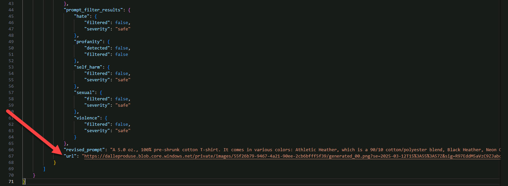
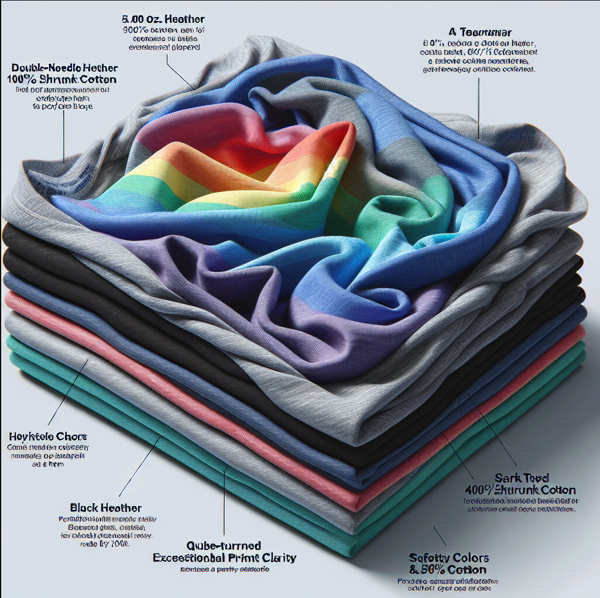
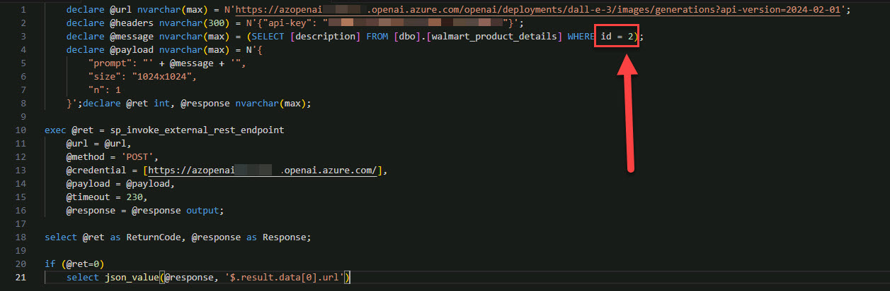

# Task 06: Use generative AI for image generation and description

## Introduction

Adatum Corporation wants to use Azure OpenAI Service to deploy models like DALL-E 3 for text-to-image generation and GPT-4o for chat completions which involves using the Azure OpenAI Service to create images from text prompts and describe those images using advanced AI models.

## Description

In this task, you'll explore the capabilities of Azure OpenAI Service.

## Success criteria

-   You deployed DALL-E 3 and GPT-4o models in Azure AI Foundry and successfully generated images from text prompts using DALL-E 3 and described those images using GPT-4o.
-   You executed SQL queries to retrieve product descriptions for DALL-E 3, sent image URLs to GPT-4o, and verified the accuracy and relevance of images and descriptions.

## Learning resources

-   [What is Azure OpenAI Service?](https://learn.microsoft.com/en-us/azure/ai-services/openai/overview)
-   [Create and deploy an Azure OpenAI Service resource](https://learn.microsoft.com/en-us/azure/ai-services/openai/how-to/create-resource?pivots=web-portal)


## Key tasks

### 01: Use Azure OpenAI Service

1.  Return to the browser that is signed into the **Azure AI Foundry \| Azure OpenAI Service**.

1.  On the left menu, select **Shared resources** \> **Deployments**.

1.  On the **Model deployments** tab select **+ Deploy model** \> **Deploy base model**.

    

4.  Select the **Inference tasks** menu, then search for and select `Text to image`.

5.  From the Text to image options, select **dall-e-3** and then select **Confirm**.

6.  In the **Deploy dall-e-3** dialog, select **Deploy**.

7.  On the **Details** tab, under **Endpoint**, enter the following values:

    | Default         | Value                |
    |-----------------|----------------------|
    | **Target URI:** | @lab.TextBox(dalle3) |
    | **KEY:** | @lab.MaskedTextBox(dalle3key) |


### 02: Use Azure OpenAI DALL-E 3

The image generation API creates an image from a text prompt.

1.  Return to the Visual Studio Code workspace and enter the following in a new query:

    ```SQL-wrap
    SELECT [Description] FROM [SalesLT].[ProductDescription] WHERE ProductDescriptionID = 457
    ```

    {: .note }
    > This returns a product description "**This bike is ridden by race winners. Developed with the Adventure Works Cycles professional race team, it has an extremely light heat-treated aluminum frame, and steering that allows precision control.**" which will be sent to the DALL-E 3 text to image endpoint.

1.  The following script retrieves a product description from the walmart_product_details table and sends it as a prompt to the DALL·E API, requesting a 1024x1024 image based on the description. Upon successful execution, the script extracts and displays the URL of the generated image. Enter the following in a new query:

    ```
    declare @url nvarchar(max) = N'@lab.Variable(dalle3)';
    declare @headers nvarchar(300) = N'{"api-key": "@lab.Variable(key)"}';
    declare @message nvarchar(max) = (SELECT [description] FROM [dbo].[walmart_product_details] WHERE id = 2);
    declare @payload nvarchar(max) = N'{
    "prompt": "' + @message + '",
    "size": "1024x1024",
    "n": 1
    }';

    declare @ret int, @response nvarchar(max);

    exec @ret = sp_invoke_external_rest_endpoint
    @url = @url,
    @method = 'POST',
    @credential = [https://azopenai@lab.LabInstance.Id.openai.azure.com/],
    @payload = @payload,
    @timeout = 230,
    @response = @response output;

    select @ret as ReturnCode, @response as Response;

    if (@ret=0)
    select json_value(@response, '$.result.data[0].url')
    ```

1.  Execute the SQL statement.

1.  Open the resulting code and copy the resulting URL in a notepad for later use.  Repalce `@lab.TextBox(dalle3url)` with it in the next steps.

    {: .warning }
    > The URL is near the bottom of the resulting json output.

    

5.  Open a new browser tab and visit the URL: `@lab.Variable(dalle3url)`

    > **Example dall-e-3 Output:**
    >
    > 

6.  Now, you are in charge. Either select a new product description ID or try creating an image yourself! Here is some inspiration:

    {: .important }
    > Note that **description id** can be modified at the end of line 3 as seen below.

    

    > **Example dall-e-3 Output. id=51**
    >
    > 


### 03: Use Azure OpenAI GPT-4o

Let's use the new GPT-4o model for this next call. You're going to ask it to describe a picture you make using the previous DALL-E 3 endpoint. To start, go wild and ask it to create some fantastical image for you. Once you've got that URL, you're going to use it in the REST call.

1.  Return to the browser that is signed into the **Azure AI Foundry \| Azure OpenAI Service**.

1.  On the left menu, select **Shared resources** \> **Deployments**.

1.  On the **Model deployments** tab select **+ Deploy model** \> **Deploy base model**.

    

1.  Select the **Inference tasks** menu, then search for and select `Chat completion`.

1.  From the Chat completion options, select **gpt-4o** and then select **Confirm**.

1.  On the **Deploy gpt-4o** window, select **Deploy**.

1.  On the **Details** tab, under **Endpoint**, enter the following values:

    | Default         | Value               |
    |-----------------|---------------------|
    | **Target URI:** | @lab.TextBox(gpt4o) |
    | **KEY:** | @lab.MaskedTextBox(gpt4okey) |

1.  Return to Visual Studio Code and enter the following in a new query:

    ```
    declare @url nvarchar(4000) = N'@lab.Variable(gpt4)';
    declare @headers nvarchar(102) = N'{"api-key":"@lab.Variable(key)"}';
    declare @payload nvarchar(max) = N'{
        "messages": [
            {
                "role": "system",
                "content": "You are an AI assistant that helps people find information."
            },
            {
                "role": "user",
                "content": [
                    {
                        "type": "text",
                        "text": "what is this an image of?"
                    },
                    {
                        "type": "image_url",
                        "image_url": {
                            "url": "@lab.Variable(dalle3url)"
                        }
                    }
                ]
            }
        ]
    }';
    declare @ret int, @response nvarchar(max);
    exec @ret = sp_invoke_external_rest_endpoint
    @url = @url,
    @method = 'POST',
    @credential = [https://azopenai@lab.LabInstance.Id.openai.azure.com/],
    @payload = @payload,
    @timeout = 230,
    @response = @response output;
    select @ret as ReturnCode, @response as Response;
    ```

    {: .note }
    > The **DALLE3_IMAGE_URL** for the image just created is inserted on line 19 of the query.

1.  Execute the SQL statement.

1.  Select the result and format it to view the return message and see if the new GPT-4o model was able to describe it.

    > **Example output**
    > 
    > ```
    > "content": {"This image shows a customized Nvidia Shield TV set-top box and controller with a vivid, colorful psychedelic design. The artistic patterns feature an abstract, vibrant, multicolor theme, giving the devices a unique, eye-catching appearance.", "refusal": null, "role": "assistant"}
    > ```

---

**Congratulations!** You've successfully completed this task.