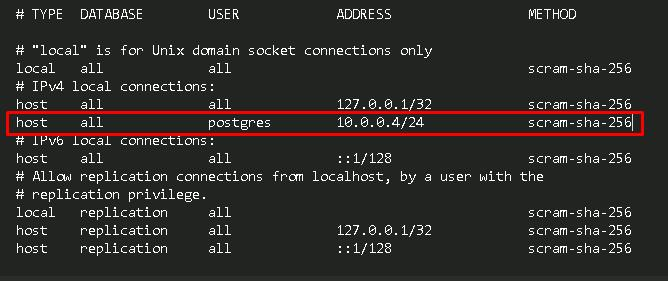
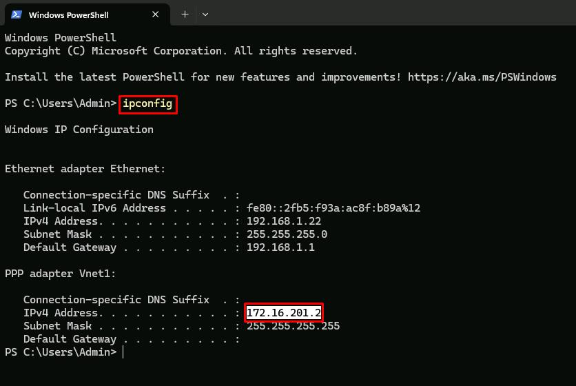
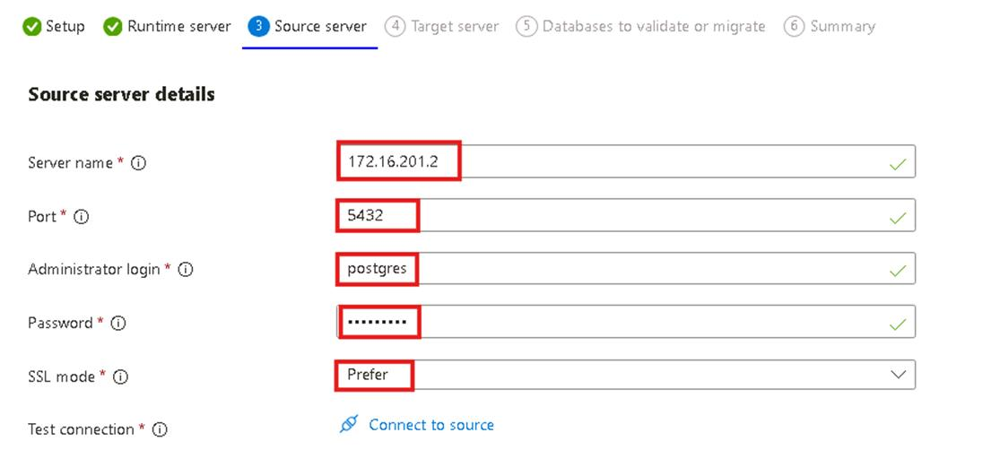
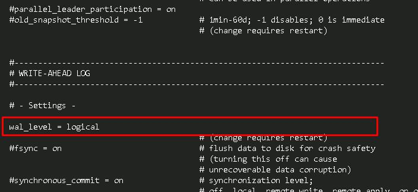
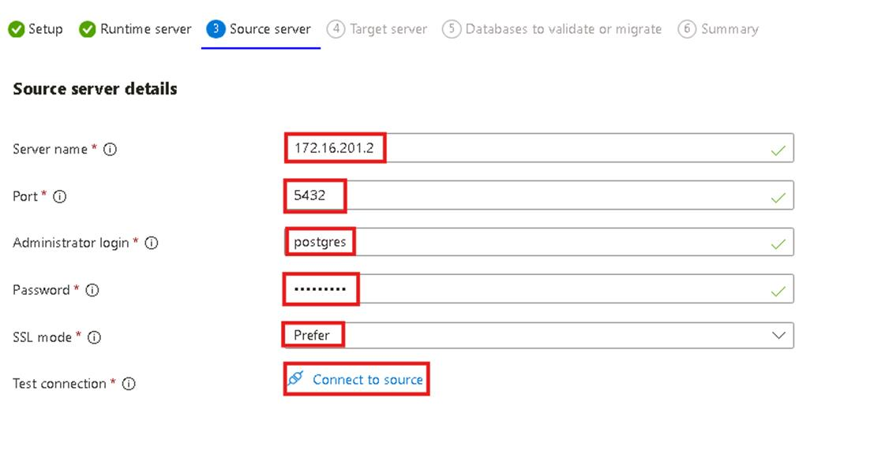
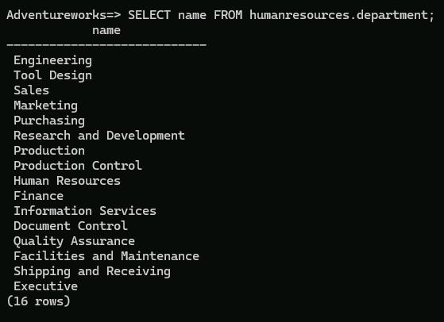

## Task 02: Complete offline and online migration 

## Introduction 

Migrating databases to the cloud requires careful planning to balance downtime, data integrity, and service continuity. The City of Metropolis needs to migrate its PostgreSQL database from an on-premises server to Azure Database for PostgreSQL while minimizing disruption. To achieve this, you'll perform both offline and online migrations.

An offline migration transfers all data in a single operation, requiring downtime but offering a simpler process. In contrast, an online migration allows data replication while keeping the source database operational until the final cutover. By using both methods, the city can assess migration strategies that best meet its operational needs.

## Description 

In this task, you'll complete an offline and an online migration of the City of Metropolis's PostgreSQL database to Azure Database for PostgreSQL. You'll start by performing an offline migration, which involves stopping database activity, transferring all data at once, and validating the results. Next, you'll configure and execute an online migration, allowing data replication while keeping the database available.

These steps help ensure the city's critical services can transition to Azure Database for PostgreSQL efficiently, with minimal downtime and maximum data integrity.

## Success criteria 

- You successfully configured and executed an offline migration of the PostgreSQL database.
- You validated that all data was migrated correctly in offline mode.
- You successfully configured logical replication for an online migration.
- You executed an online migration, ensuring data synchronization between on-premises and Azure.
- You verified that all database records were successfully transferred and are accessible in Azure.

## Learning resources 

- [Azure Database for PostgreSQL - Flexible Server](https://learn.microsoft.com/en-us/azure/postgresql/flexible-server/overview)
- [What is the migration service in Azure Database for PostgreSQL?](https://learn.microsoft.com/en-us/azure/postgresql/migrate/migration-service/overview-migration-service-postgresql)


### 01: Perform offline migration 

You will finalize necessary configurations and perform an offline migration of the Adventureworks database. This approach is suitable when a brief service interruption is acceptable.

1. From the Azure portal, on the top global search bar, enter and select `Private DNS zones`. 

     

1. Select **azuredb@lab.labInstance.Id.private.postgres.database.azure.com**. 

1. On the left service menu, select **DNS Management** > **Recordsets**.

1. Identify the private IP address listed under **Value**. This should be the only address, which belongs to the new server. 

     

    {: .note }
    > Your IP may differ from the screenshot. 

1. Enter the IP address in a notepad for future use: 

    
   {: .note}
   > If you see this in the next steps `@lab.TextBox(privateIP)`, you'll need to replace it with the IP address you've saved here. 

1. Select **Windows Explorer** from the taskbar, and then go to `C:\Program files\PostgreSQL\16\data`.

1. Right-click the **pg_hba.conf** file, then select **Edit in Notepad**.

1. In Notepad, go to the bottom of the **pg_hba.conf** file and add an entry under **# IPv4 local connections** with the following: 

    | Item | Value | 
    |:---------|:---------| 
    | TYPE   | `host` | 
    | DATABASE   | `all`   |  
    | USER  |   `postgres` 
    | ADDRESS    |   `@lab.Variable(privateIP)/24` 
    | METHOD    |   `scram-sha-256` 

    {: .note }
    > The **ADDRESS** listed above is the IP address from the earlier text box. If it's blank here, ensure the text box from step 5 is filled out. 

    

1. Ensure the file looks like the  above, with the exception of the **ADDRESS**, if it's different. 

1. Save and close the file. 

1. In Azure's global search bar, enter and select the `azuredb@lab.LabInstance.Id` Azure Database for PostegreSQL flexible server.

1. On the **azuredb@lab.LabInstance.Id** page, on the leftmost service menu, select **Settings** > **Server parameters**. 

1. Enter `azure.extensions` in the search filter. 

1. For the **azure.extensions** parameter, select the **Value** dropdown menu, then select the checkboxes for:

    - `TABLEFUNC`
    - `UUID-OSSP`
    
1. On the top bar, select **Save**. 

     

1. Once the deployment of the parameters is complete, select **Go to resource**.

1. On the **azuredb@lab.LabInstance.Id** page, on the leftmost service menu, select **Migration**. 

1. On the **Migration** page, select **+ Create**. 

     

1. Enter the following settings: 

    | Item | Value | 
    |:---------|:---------| 
    | Migration name   | +++offlinemigration+++ | 
    | Source server type   | **On-premises server**  |  
    | Migration option  |   **Validate and migrate** 
    | Migration mode    |   **Offline** 

     

1. Select **Next: Runtime server >**. 

1. On the **Select Runtime Server** step, leave the default option of **No** selected, then select **Next: Source server >**. 

1. On the Windows taskbar, open **Windows PowerShell**.

1. Run 

    ```
    ipconfig
    ``` 

1. Select and copy the IP address listed under the **Vnet1** connection, then close PowerShell. 

    {: .note }
    > Select the text and select **Ctrl+C** to copy. 

    

1. Enter the IP address in a notepad for future use: 

    {: .note }
    > When you see this `@lab.TextBox(VPN)` in a formula in the next steps, you need to replace it with the IP address for the VPN.

1. In Azure portal, on the **Source server** tab, configure the following settings: 

    | Item | Value | 
    |:---------|:---------| 
    | Server name   | `@lab.Variable(VPN)` | 
    | Port   | `5432`   |  
    | Administrator login  |   `postgres`  |
    | Password    |   `Passw0rd!` |
    | SSL mode   | **Prefer**   |  

     

    {: .note }
    > Your IP may differ from the screenshot. 

1. Select **Connect to source**. 

1. Once the connection test completes, select **Next: Target server >**. 

1. For **Password**, enter `Passw0rd!`, then select **Connect to target**. 

1. Once the connection test completes, select **Next: Databases to validate or migrate >**. 

1. Select the checkbox for **Adventureworks**, then select **Next: Summary >**. 

1. Select **Start validation and migration**. 

    {: .warning }
    > This process may take 3-4 minutes. 

    {: .important }
    > In an offline migration, all applications that connect to the source instance are stopped. The tradeoff is that it requires less configuration and performs faster. This can be useful in situations where downtime or maintenance is expected. 

1. Select **Refresh** on the **azuredb@lab.LabInstance.Id - Migration** page periodically until the **offlinemigration** job is complete. 

1. Once the migration is complete, select **offlinemigration**. 

     

1. Everything should show as **Succeeded**. At the bottom, select the link to the **Adventureworks** database. 

1. In the **Validation and migration details for Adventureworks** flyout menu, select the **Migration** tab. 

1. Verify the **Database Status** shows as **Succeeded** and the **Number of tables copied** shows as **68**. 

     

 
### 02: Perform online migration 

Next, you will configure connection options and execute an online migration, ensuring minimal disruption and enabling the city to continue providing public services without extended downtime.

1. From Windows File Explorer, go to `C:\Program Files\PostgreSQL\16\data`.

1. Right-click **postgresql.conf** > **Edit with Notepad**. 

1. In Notepad, select **Ctrl+F** to find the value `wal_level`.

1. Delete the **#** at the start of the line to uncomment the setting.

1. Set the **wal_level** value to `logical`, and then remove the comment to the right. 

    

1. Save and close the file. 

1. A server restart is required for the changes to take effect. Right-click the Windows icon in the lower left, select **Shut down or sign out**, then select **Restart** to reboot the VM. 

1. You'll see a dialog to reconnect to the VM. Select **Retry Connection**.

1. Sign back in to the VM using your credentials: 

1. Reconnect to the VPN. In the lower-right corner of the Windows Taskbar, right-click the network icon, then select **Network and Internet settings**. 

1. Select **VPN**.

1. On the line for **Vnet1**, select **Connect**. 

1. In the elevated privlege dialog, select **Continue**. 

1. In the **User Account Control** dialog, select **Yes**. 

1. Verify that **Vnet1** is connected successfully. The word "**Connected**" should show under the **Vnet1** connection.

1. Open Microsoft Edge. If your session is not restored, open it and go to `portal.azure.com`. 

1. Sign in again to the Azure portal using your credentials.
 
1. From the Azure portal home page, select the `azuredb@lab.LabInstance.Id` Azure Database from the **Recent** list of resources. 

1. On the **azuredb@lab.LabInstance.Id** page, select **Migration** from the leftmost service menu.

1. Select **+ Create**. 

     

1. Enter the following settings: 

    | Item | Value | 
    |:---------|:---------| 
    | Migration name   | +++onlinemigration+++ | 
    | Source server type   | **On-premises Server**   |  
    | Migration option  |   **Validate and Migrate** |
    | Migration mode    |   **Online**  |

    {: .note }
    > When switching from **Offline** to **Online** for the **Migration mode**, you might notice an additional prerequisite is added below. The additional prerequisite for the online connection is to set the **WAL_LEVEL** to **logical** in the source server. This is the reason for the extra configuration and server reboot earlier. 

1. Select **Next: Runtime server >**. 

1. On the **Select Runtime Server** tab, leave the default option of **No** selected and select **Next: Source server >**. 

1. Enter the following settings: 

    | Item | Value | 
    |:---------|:---------| 
    | Server name   | `@lab.Variable(VPN)` | 
    | Port   | `5432`   |  
    | Administrator login  |   `postgres` 
    | Password    |   `Passw0rd!` 
    | SSL mode   | **Prefer**   |  

     

1. Select **Connect to source**.

1. Once the connection test completes, select **Next: Target server >**. 

1. For **Password**, enter `Passw0rd!`, then select **Connect to target**. 

1. Once the connection test completes, select **Next: Databases to validate or migrate >**. 

1. Select the checkbox for **Adventureworks**, then select **Next: Summary >**. 

    {: .important }
    > After selecting the **Adventureworks** database, there will be an additional checkbox. This is authorizing Azure to overwrite the data from the previous migration with the data from this one. In this case, the data is the same and we can proceed without fear of data loss. However, in a production environment, pay attention to this setting to determine when you're about to overwrite data. 

1. Select **Start Validation and Migration**. 

    {: .warning }
    > This process may take 3-4 minutes. 

    {: .important }
    > An online migration has more steps and takes a bit more time, but the source server applications aren't stopped in the process. Data is copied to the target server, then a cutover is performed to finalize the migration with no downtime in between. 

1. Select **Refresh** on the **azuredb@lab.LabInstance.Id - Migration** page periodically until the **onlinemigration** job status shows as **Waiting For Use**. 

1. From the Windows taskbar, select **Windows PowerShell**.

1. Run the following command to connect to the newly migrated **Adventureworks** database: 

    ```
    psql -h @lab.Variable(privateIP) -p 5432 -U postgres Adventureworks
    ``` 

1. Enter `@lab.VirtualMachine(Windows1124H2).Password` for the password.

    {: .warning }
    > The text cursor for password entry does not move. You may need to select **Enter** a couple times.

    {: .note }
    > The warning is safe to ignore.

1. Once connected to the **Adventureworks** database, run the following command: 

    ```
    SELECT name FROM humanresources.department;
    ``` 

    

    {: .important }
    > This command should return a list of 16 rows, showing the records in the **department** table. Since the online migration hasn't been completed yet, the data is being pulled from the offline migration performed earlier. With the online migration method, data can be added even after the migration has started, as long as the cutover hasn't been performed yet. Let's add a new row now to test this. 

1. Run the following command to add a new row to the **department** table. 

    ```
    INSERT INTO humanresources.department VALUES (17, 'Logistics', 'Inventory Management', DEFAULT);
    ``` 

1. Minimize the PowerShell connection, you'll return to it later. 

1. Return to the Azure portal and the **azuredb@lab.LabInstance.Id - Migration** page. 

1. Select **onlinemigration** from the list.

     

1. On the **onlinemigration** page, select **Cutover**, then select **Yes**. 

    {: .warning }
    > This process may take 5-7 minutes to complete. 

     

1. Select **Refresh** on the **onlinemigration** page until the **Validation status** shows as **Succeeded**. 

1. At the bottom of the **onlinemigration** page, select the link to the **Adventureworks** database. 

1. In the **Validation and migration details for Adventureworks** flyout menu, select the **Migration** tab. 

1. Verify the **Database Status** shows as **Succeeded** and the **Number of tables copied** shows as **69**. 

     

1. Return to the **azuredb@lab.LabInstance.Id - Migration** page selecting the breadcrumb link in the upper left. 

1. Refresh the **azuredb@lab.LabInstance.Id - Migration** page and verify that the **onlinemigration** shows as **Succeeded**. 

     

1. Go back to **Windows PowerShell**. You should still be connected to the **Adventureworks** database. 

    {: .note }
    > If you closed the window and need to reconnect, run the following command: 
    >
    > ```
    > psql -h @lab.Variable(privateIP) -p 5432 -U postgres Adventureworks
    > ``` 
    >
    > **Password**: `@lab.VirtualMachine(Windows1124H2).Password`

1. Run the following command: 

    ```
    SELECT name FROM humanresources.department;
    ``` 

     

    {: .important }
    > We're running this command again to check the row names in the **department** table. At the bottom of the results, notice that the **Logistics** record was migrated successfully. 

---

## Conclusion 

**Congratulations!** You've successfully completed this task and have completed the **Migrate an on-premises PostgreSQL server to Azure Database for PostgreSQL** lab. 