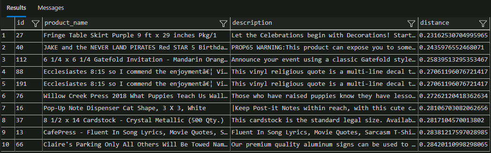
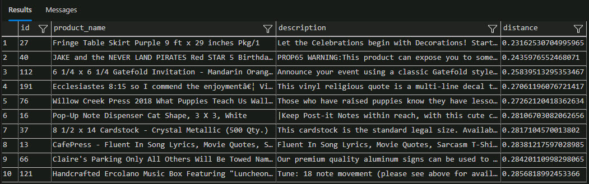

# Task 03: Use vector search with vector functions

## Introduction

Adatum Corporation wants to provide a more personalized and intelligent search experience for their customers by using vector search with vector functions. This allows for more accurate and relevant search results by considering the semantic meaning of the search query and product descriptions.

## Description

In this task, you’ll perform a vector search using vector functions within a SQL database. You'll convert the search text into a vector representation using the `create_embeddings` stored procedure. Then, you’ll use `vector_distance` function to compute the cosine distance between the search vector and the product description vectors in the database. The results will be ordered by distance, with the closest vectors (most semantically similar) appearing first.

## Success criteria

-   You generated a vector representation of the search text using the `create_embeddings` stored procedure.
-   You successfully performed a vector search query based on semantic similarity and ordered the search results by cosine distance to ensure that the most semantically similar products appear first.

## Learning resources

-   [Overview of vectors in the SQL Database Engine](https://learn.microsoft.com/en-us/sql/relational-databases/vectors/vectors-sql-server?view=azuresqldb-current)
-   [How vector search works in Azure AI Search](https://learn.microsoft.com/en-us/azure/search/vector-search-overview#how-vector-search-works-in-azure-ai-search)
-   [Vector similarity search with Azure SQL & Azure OpenAI](https://learn.microsoft.com/en-us/samples/azure-samples/azure-sql-db-openai/azure-sql-db-openai/)

## Key tasks

### 01: Perform a vector search with vector functions

<details markdown="block"> 
  <summary><strong>Expand this section to view the solution</strong></summary> 

This SQL script demonstrates how to perform a vector search using vector functions within a SQL database. The goal is to find the top 10 most relevant products from the **walmart_product_details** table that match a given search query based on semantic similarity.

**How it works**

-   **Text to Vector Conversion**:
    -   The search text, in this case, **help me plan a high school graduation party**, is declared as a **nvarchar(max)** variable named **@search_text**.
    -   A **vector(1536)** variable named **@search_vector** is declared to store the vector representation of the search text.
-   **Creating Embeddings**:
    -   The **dbo.create_embeddings** stored procedure is executed with **@search_text** as input and **@search_vector** as output.
    -   This procedure converts the search text into a vector embedding, which captures the semantic meaning of the text.
-   **Vector Search Query**:
    -   The **SELECT** statement retrieves the top 10 records from the **walmart_product_details** table.
    -   The **vector_distance** function computes the **cosine** distance between the **@search_vector** and the **product_description_vector** column in the table.
    -   The results are ordered by the **distance**, with the closest vectors (most semantically similar) appearing first.

1.  Enter the following in a new query:

    ```SQL-wrap
    /*-- Declare the search text*/
    declare @search_text nvarchar(max) = 'help me plan a high school graduation party';

    /*-- Declare a variable to hold the search vector*/
    declare @search_vector vector(1536);

    /*-- Generate the search vector using the 'create_embeddings' stored procedure*/
    exec dbo.create_embeddings @search_text, @search_vector output;

    /*-- Perform the search query*/
    SELECT TOP(10)
    id, product_name, description,

    /*-- Calculate the cosine distance between the search vector and product description vectors*/
    vector_distance('cosine', @search_vector, product_description_vector) AS distance
    FROM [dbo].[walmart_product_details]
    ORDER BY distance; -- Order by the closest distance
    ```

    > **Example Output:**
    >
    >

1.  As there are duplicate products, rewrite the query to remove duplicates by entering the following in a new query:

    ```SQL-wrap
    declare @search_text nvarchar(max) = 'help me plan a high school graduation party';

    /*-- Declare a variable to hold the search vector*/
    declare @search_vector vector(1536);

    /*-- Generate the search vector using the 'create_embeddings' stored procedure*/
    exec dbo.create_embeddings @search_text, @search_vector output;

    /*-- Perform the search query*/
    SELECT TOP(10)
    id,
    product_name,
    description,

    /*-- Calculate the cosine distance between the search vector and product description vectors*/
    vector_distance('cosine', @search_vector, product_description_vector) AS distance
    FROM (
    SELECT
    id,
    product_name,
    description,
    product_description_vector,
    ROW_NUMBER() OVER (PARTITION BY product_name, description ORDER BY (SELECT NULL)) AS rn
    FROM [dbo].[walmart_product_details]
    ) AS unique_products
    WHERE rn = 1
    ORDER BY distance;
    ```

    > **Example Output**
    >
    > 

---

**Congratulations!** You've successfully completed this task.

</details>
