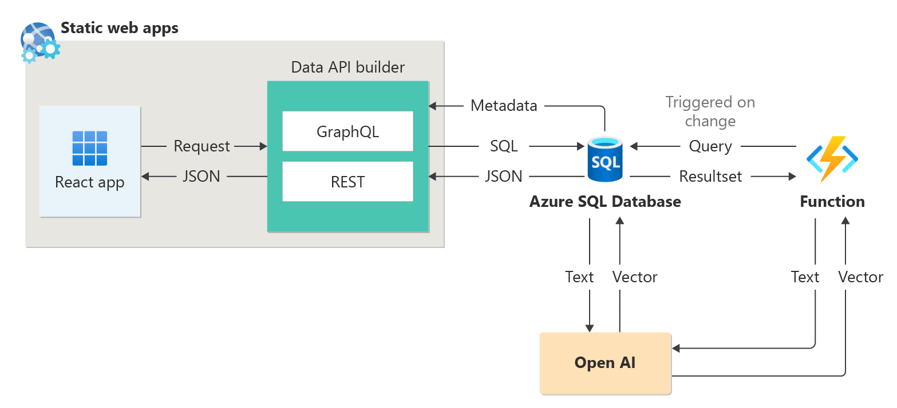
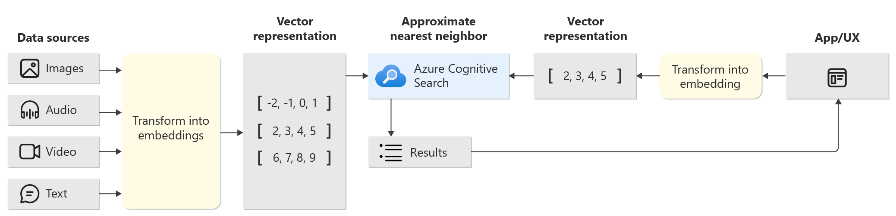
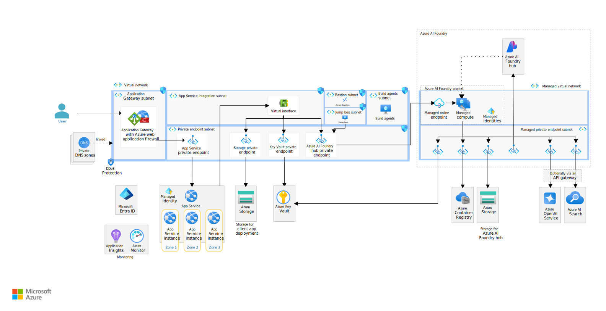

# Exercise 02: Implement generative AI with Azure SQL and REST endpoints

## Scenario

Adatum Corporation, is a national retail chain headquartered in Atlanta, GA, and operates 1,500 stores across the United States. The company is committed to leveraging cutting-edge technology and AI-driven tools to enhance customer interactions and streamline operations. To achieve this, Adatum Corporation is focusing on integrating generative AI capabilities into their existing systems using Microsoft Azure SQL Database and REST endpoints.

Adatum Corporation wants to set up generative AI by integrating AI capabilities with Azure SQL Database, to enable the company to manage and analyze vast amounts of customer data more efficiently. The company also wants to use REST API calls to Azure AI Content Safety and Azure OpenAI services, ensuring that their AI-driven tools adhere to safety standards and provide reliable outputs. They also want to extend AI scenarios with hybrid search and generative AI implementations, allowing the company to offer personalized and intelligent search experiences to their customers.

## Objectives

After you complete this exercise, you'll be able to:

-   Set up and configure an Azure SQL Database for generative AI applications.
-   Extend AI scenarios with hybrid search and generative AI implementations.
-   Use generative AI to create recommendations and to generate and describe images.
-   Integrate Azure AI Content Safety using REST API calls to ensure adherence to safety standards.

## Architecture

### Task 02: Create and store embeddings in the Azure SQL Database

### Task 03: Use vector search with vector functions

### Task 05: Use generative AI for recommendations / Task 06: Use generative AI for image generation and description

## Duration

**Estimated time:** 90 minutes
