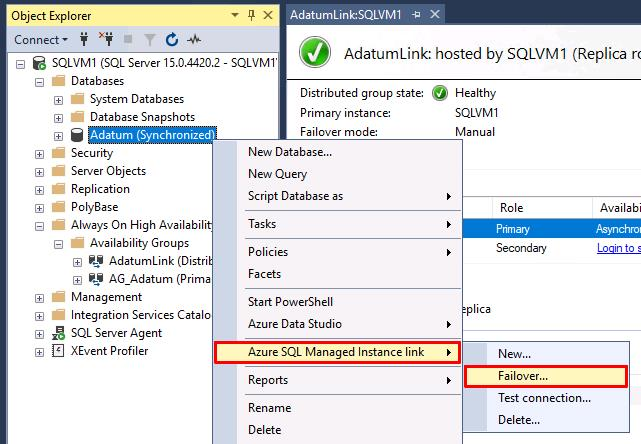
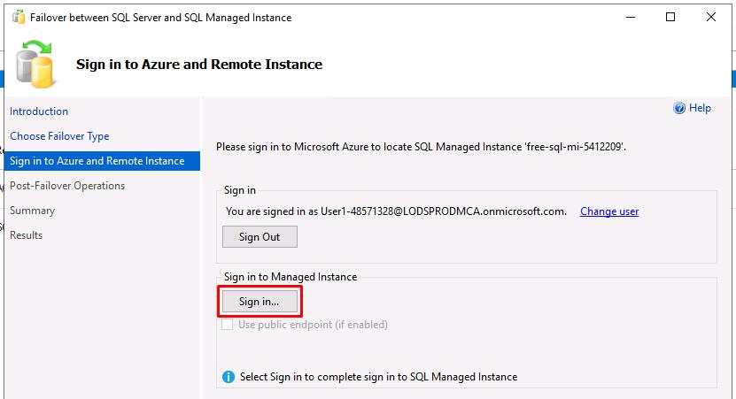
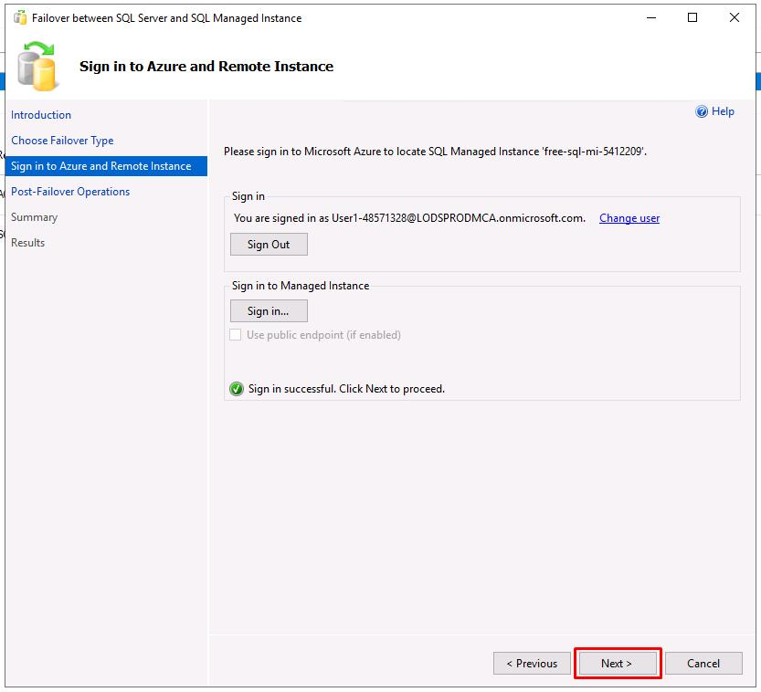
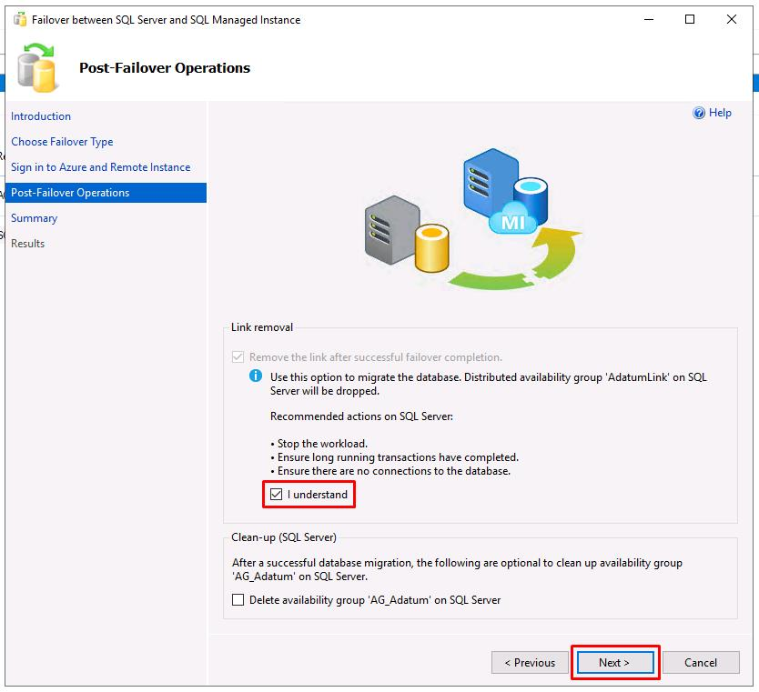
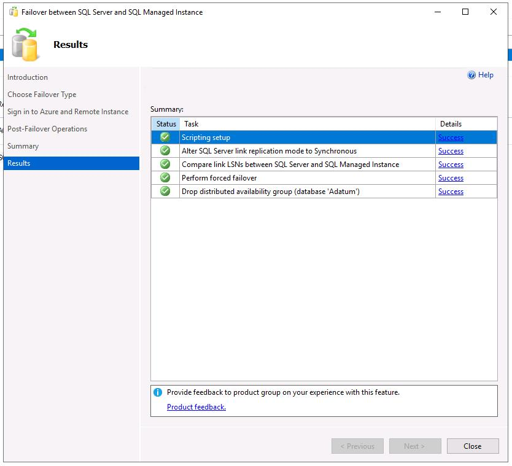
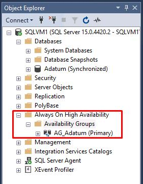
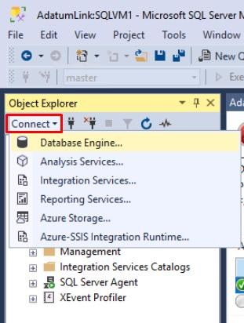
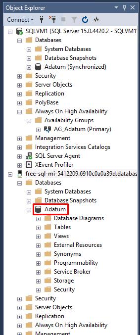

# Task 04: Data sync and cutover

## Introduction

This final task involves performing a planned failover to the Azure SQL Managed Instance. By performing a planned failover, you’ll help Adatum Corporation maintain business continuity and prevent disruptions to their eBook shopping services. This ensures that Adatum Books remains operational even in the event of a failure, providing a seamless experience for their customers.

## Description

In this final exercise, you'll perform a planned failover to the Azure SQL Managed Instance, breaking the link and making the Managed Instance the new primary database.

## Success criteria

-   You performed a planned failover to the Azure SQL Managed Instance.
-   You successfully broke the link and made the Managed Instance the new primary database.

## Learning resources

-   [Overview of the Managed Instance link](https://learn.microsoft.com/en-us/azure/azure-sql/managed-instance/managed-instance-link-feature-overview?view=azuresql)
-   [Configure link with SSMS - Azure SQL Managed Instance](https://learn.microsoft.com/en-us/azure/azure-sql/managed-instance/managed-instance-link-configure-how-to-ssms?view=azuresql)

---

In a production environment, you would typically want to follow these steps for the data migration during a maintenance window:

1.  Stop the workload on the primary SQL Server database so the secondary database on SQL Managed Instance catches up.
2.  Validate all data has made it over to the secondary database on SQL Managed Instance.
3.  Fail over the link to the secondary SQL managed instance by choosing **Planned failover**.
4.  Cut over the application to connect to the SQL managed instance endpoint.

## Key tasks:

### 01: Fail over the Adatum database using SSMS

 
  
<strong>Expand this section to view the solution</strong>
 

1. In the SSMS **Object Explorer**, right-click on the **Adatum (Synchronized)** database, select **Azure SQL Managed Instance link**, then select **Failover...**.

    

1. In the new windows Introduction page, select **Next**.

1. **Planned manual failover** will be selected for the failover type. Select **Next**.

1. If it launches a browser window, sign in with your lab credentials:

    | Item | Value |
    |:--------|:--------|
    | Username   | `Your Azure username`   |
    | Password  | `Your Azure password`   |

1. Close the browser window.

1. Select **Sign in...** under **Sign in to Managed Instance**.

    

1. Use the following on the **Connect to Server** window:

    | Item | Value |
    |:--------|:--------|
    | Authentication   | **SQL Server Authentication**   |
    | Login  | **`MILab`**   |
    | Password  | **`@lab.Variable(azurePw)`**   |

1. Select **Connect**.

1. Select **Next**.

    

1. Select the **I understand** checkbox under **Link removal**, then select **Next**.

    

    {: .important }
    > Failing over to a SQL Managed Instance stops replication, breaks the link, and drops the distributed availability group.

1. On the **Summary** step, review the actions, then select **Finish** when you're ready to fail over the database.

    {: .important }
    > You can select **Script** to generate a script to easily fail over the database using the same link in the future. 

1. All entries on the **Results** should show **Success**.

    

1. Select **Close** on the window. You'll see that the distributed availability group no longer exists.

    

---

### 02: Cut over to the SQL Managed Instance

 
  
<strong>Expand this section to view the solution</strong>
 

1. At the top of SSMS's **Object Explorer**, select **Connect**, then select **Database Engine**.

    

1. If it's not already filled out, use the following on the **Connect to Server** window:

    | Item | Value |
    |:--------|:--------|
    | Server name   | **`@lab.Variable(miHost)`**   |
    | Authentication   | **SQL Server Authentication**   |
    | Login  | **`MILab`**   |
    | Password  | **`@lab.Variable(azurePw)`**   |

1. Select **Connect**.

1. Verify the state of the **Adatum** database in the Managed Instance.

    

---

# Conclusion

**Congratulations!** You've successfully migrated a SQL Server database to an Azure SQL Managed Instance.

---

In a real-world scenario, after you successfully complete the migration stage, you should go through a series of post-migration tasks to ensure that everything is functioning efficiently.

This phase is crucial for reconciling any data accuracy issues, verifying completeness, and addressing performance issues with the workload.

For more details, review the [Post-migration](https://learn.microsoft.com/en-us/data-migration/sql-server/managed-instance/guide?view=azuresql#post-migration) section of the migration guide.

